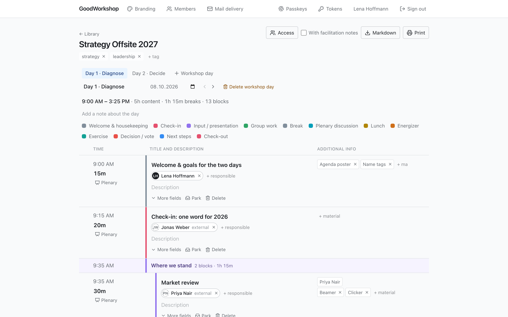
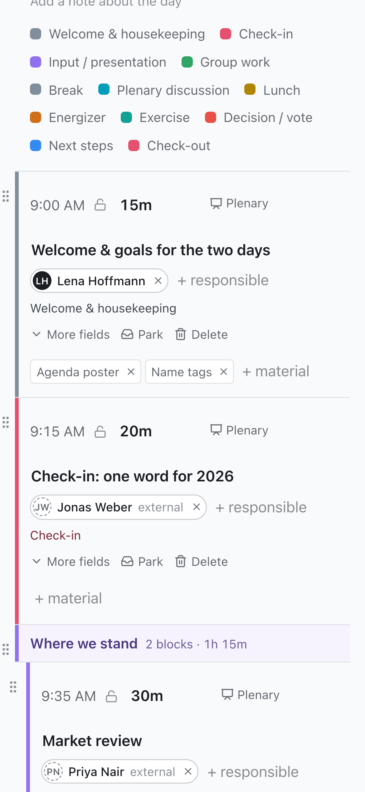
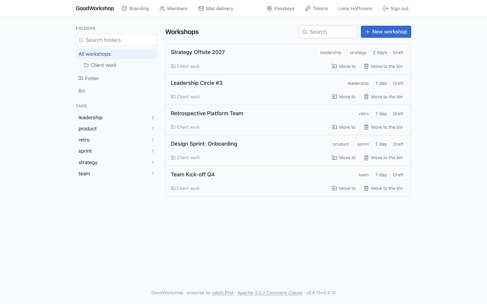
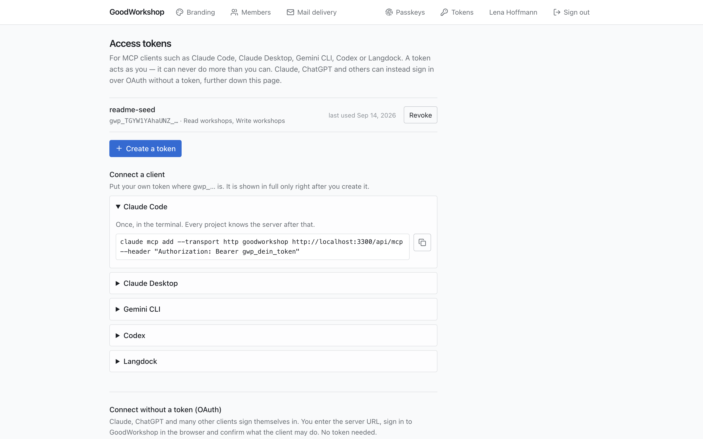

# GoodWorkshop

**The workshop planner for people who run workshops.** Plan the day, not the spreadsheet.

You know the moment: the client moves lunch, one exercise runs long, and suddenly every time on
your agenda is wrong. GoodWorkshop takes that off your plate. Drag a block, and the day
recalculates itself. Pin what must not move, park what you might still need, and walk into the
room with an agenda that is always right, on your laptop and on your phone.



## At a glance

- **MCP-ready.** Let Claude, ChatGPT, Gemini or any other MCP client draft and rework your
  agenda. It is a built-in MCP server, not an add-on.
- **Lightweight.** One container image and one Postgres. No external services, no tracking, no
  heavyweight setup. Up in minutes with Docker Compose.
- **Free when you host it yourself.** Commercial use included: plan and run the workshops you
  earn your money with, at no licence cost.
- **Your data stays with you.** It runs on your server, and every agenda is exported as
  Markdown whenever you want.
- **Built for the room.** Works on a phone, survives bad wifi, and lets your co-facilitator edit
  the same day live.

> **Released and in use.** The current version is on the
> [releases page](https://github.com/roleALPHA/good-workshop/releases); images are published to
> `ghcr.io/rolealpha/good-workshop` for amd64 and arm64.

## Why facilitators love it

**Your agenda does the arithmetic.** A workshop is made of days, and a day is made of blocks:
check-ins, inputs, group work, breaks. Group them into clusters and reorder them by dragging.
Every time that follows moves along with them. The header always shows how much is content, how
much is breaks, and how far the day runs past the end you set.

**What must not move stays put.** Lunch at 12:30, the client's slot at 15:00: pin a start time
and it holds while you rearrange everything around it. If something collides with a pinned
block, the row tells you, for example _overlaps the previous block by 20m_. Nothing is quietly
shortened behind your back.

**Everybody knows who is on.** Every block has one or more responsible people, shown as chips
with initials right under the title. Pick a member of your team, or just type the name of the
guest speaker or client lead who is not in the system. The print view, the Markdown export and
your AI client all know who does what.

**Cut without losing.** Too much for one day? **Park** a block. It keeps its description and
its material but stops counting toward the time. The parking area belongs to the whole
workshop, so an exercise you cut on day one can go straight into day two.

**Everything the room needs, right in the row.** Social form (plenary, small groups, pairs,
individual), the material to bring, and the fields each block type needs. You edit all of it
where it stands. There are no dialogs, because a dialog gets between you and the agenda you are
reading.

**Your notes stay yours.** Facilitation notes belong to the block and stay with you. The print
view and the Markdown export leave them out by default, so the group gets the agenda and you
keep the rest.

**As many days as your workshop has.** Every day has its own start, its own agenda and its own
note. Add a day, name and date it, and switch between days with the tabs above the agenda.

**Fifteen block types, ready to go.** Check-in, input, group work, exercise, discussion,
decision, energizer, reflection, break, lunch, buffer, next steps, check-out and more. Each one
brings the fields it actually needs. Type in the picker and the list narrows as you go.

**Type durations the way you think.** `45`, `45m`, `1h`, `1:30`, `1h30`, `90`, or `1 Stunde`,
`1 heure`, `1 hora` in your own language. If GoodWorkshop cannot read something, it asks
instead of guessing.

<p align="center">
  
</p>

**Made for standing in front of a group.** On a phone, the day turns into cards: body text never
smaller than 16px, tap targets of 44px, and the section you are in stays pinned to the top.
Dragging needs a long press, so a swipe still scrolls. Social form, material and the clock are
one tap away.

**Survives a bad room.** The wifi drops out? The agenda says so, keeps accepting your changes
and syncs them once the connection is back.

**Plan together, live.** Several people can edit the same workshop day at once. The presence
bar shows who is there, and changes appear instantly for everybody and merge instead of
overwriting each other.

**Leaves the room with you.** A print view that fits on paper, and a Markdown export for the
protocol, the wiki or the follow-up mail, in the language of whoever exported it.

**Find anything again.** Workshops live in folders and carry tags, both optional. Folder, tag
and search are part of the URL, so a filtered library is a link you can share.



**Built for teams.** An admin invites people by e-mail under **Members**. The owner of a
workshop grants access under **Access**, to edit or to read. Share a whole **folder** and
everything inside it comes along. Nobody can pass on more access than they have.

**Share with clients who have no account.** Invite any e-mail address to one agenda, read-only
or with editing. They see that one agenda and nothing else from your installation. The link
works until the last day of the workshop, and you can withdraw it at any time.

**No passwords.** Sign in with a magic link by e-mail, or with a passkey: Face ID, Touch ID or
a hardware key. There is no password to forget, reuse or leak.

**Speaks your language.** German, English, French and Spanish: interface, e-mails, export and
block types. Everybody picks their own language, and the text you write stays exactly as you
wrote it.

**Looks like you.** Add your logo and accent colour under **Branding**. The light and dark
shades are derived automatically.

**Forgives mistakes.** A deleted workshop goes to the bin, not away. It comes back with one
click, and it is only really gone when somebody deletes it for good, by name.

### Plan with your AI assistant

GoodWorkshop is an MCP server. Claude Desktop, Claude Code or any other MCP client can do what
the library and the day editor do: folders, workshops, tags, the bin, days and whole agendas,
including responsible people and parked blocks. Ask for "a two-day strategy offsite with a
SWOT in four groups" and watch it appear. Sharing and user administration stay in the app.

Create a token under **AI Connection** in the profile menu at the top right. The page prints the
ready-made command or configuration for Claude Code, Claude Desktop, the Gemini CLI, Codex and
Langdock, with your host and token already filled in. A token acts as the person who created it: it can never do
more than that person, and it cannot touch user administration at all.



Clients that cannot hold a fixed token, such as ChatGPT's connectors or the connector UI in
claude.ai, connect over **OAuth**. They discover your installation, register themselves, and
you approve them once on a consent screen that says which client is asking and what it will be
allowed to do. There is nothing to configure. The **AI Connection** page walks you through it
for Claude, ChatGPT, Claude Code, the Gemini CLI and other clients, including two things the flow
does not tell you: hosted clients need your installation to be reachable from the internet, and
you should be signed in before you connect. A client connected this way may read and write
workshops, exactly like a token with those two scopes.

How GoodWorkshop is built on the inside, and why, is in
[docs/architecture.md](docs/architecture.md).

## Installation (on-premise)

### Requirements

- Docker with Compose v2 (`docker compose version`), amd64 or arm64
- A hostname that resolves publicly to this server, and ports 80 and 443 free — Let's Encrypt
  needs both to issue the certificate
- No Postgres needed: the database runs inside the stack and is not reachable from outside
- No passwords to hand out: the stack generates the database secrets itself on first start

### 1. Get the files

You need `compose.yaml`, `Caddyfile` and a `.env`:

```bash
git clone https://github.com/roleALPHA/good-workshop.git
cd good-workshop
cp .env.example .env
```

### 2. Provide the image

The releases are published to the GitHub Container Registry, and `compose.yaml` pulls the one
`GW_VERSION` names when the stack first comes up. `latest` always points at the newest stable
release (currently `v0.7.3`). Every release is also published under its own tag, without the
`v` (`0.7.3`) — set that instead to stay on one version until you decide to update. There is
nothing to build.

To run a state that carries no tag of its own, build it and give it the name `compose.yaml`
expects:

```bash
docker build -t ghcr.io/rolealpha/good-workshop:local .
```

Then set `GW_VERSION=local` in the `.env`.

### 3. Fill in the `.env`

Three values are required; without them the stack does not start and says which one is
missing:

```bash
GW_APP_URL=https://workshop.example.com   # the address the app is reachable at
GW_HOSTNAME=workshop.example.com          # the name in the certificate (profile `tls`)
GW_VERSION=latest                         # the newest stable release, or e.g. 0.7.3 to pin one
```

**Mail can wait.** The first start does not need it: the setup screen shows your sign-in link
itself. Afterwards you set up mail delivery in the interface under **Mail delivery** — SMTP,
Microsoft Graph, or nothing. If you would rather keep it in the `.env`, set
`GW_MAIL_TRANSPORT` (`smtp`, `graph`, `console` or `none`) there; the environment then wins per
field, and the screen says which fields it has already claimed.

With `GW_MAIL_TRANSPORT=smtp` you also need `SMTP_URL` and `SMTP_FROM`, in the `.env` or in the
interface. If the `SMTP_URL` contains a password, it belongs in a file instead:
`SMTP_URL_FILE=/run/secrets/smtp_url`. An environment variable shows up in `docker inspect`, in
`/proc/<pid>/environ` and in every core dump.

**Microsoft 365 without SMTP:** many tenants have SMTP AUTH switched off — there
`GW_MAIL_TRANSPORT=graph` is not the more convenient way but the only one. You need an app
registration in Entra ID with the **application permission** `Mail.Send` (not the delegated
one) plus admin consent, and the mailbox to send from:

```bash
GW_MAIL_TRANSPORT=graph
GW_GRAPH_TENANT_ID=contoso.onmicrosoft.com   # or the directory id
GW_GRAPH_CLIENT_ID=00000000-0000-0000-0000-000000000000
GW_GRAPH_CLIENT_SECRET_FILE=/run/secrets/graph_secret
GW_GRAPH_SENDER=workshop@contoso.com
```

If one of these is missing, the application says so at startup — not when somebody first
fails to sign in. With `Mail.Send` alone Graph can do nothing but send: the permission does
not allow reading mailboxes.

**Decide the hostname now** — changing it later invalidates every registered passkey. See
[Things that trip people up](#things-that-trip-people-up).

### 4. Start

```bash
docker compose --profile tls up -d
```

In order: `secrets` generates the database passwords, `db` starts, `migrate` creates the
roles, checks the existing data, walks through the migrations and provisions the block types.
`app` starts only once `migrate` has come through cleanly, then `caddy` takes 80 and 443 and
fetches the certificate.

Once it runs, the healthcheck answers:

```bash
curl -fsS https://workshop.example.com/api/health
# {"status":"ok","checks":[{"name":"database","ok":true},{"name":"migrations","ok":true}]}
```

A `503` is not a crash but the honest answer "this container cannot serve" — `checks` says
whether it is the database or the migration state.

### 5. Set it up in the browser

A fresh installation announces itself in the log on every start, until somebody claims it:

```bash
docker compose logs app
```

```
  This installation has no administrator yet.

    https://workshop.example.com/setup
    Setup key: 7Qb3…

  The key is valid until this process restarts.
```

Open that address, enter your e-mail address and the key, and the installation is yours.
Everything after that — mail delivery, further people, branding — happens in the interface.
Cannot find the key or the link? See [Troubleshooting](#troubleshooting).

**The key is the whole access control on that screen**, and it is deliberate: a first-run page
that hands out the administrator account to whoever loads it is a takeover waiting for the gap
between `docker compose up` and you opening your browser. Whoever can read
`docker compose logs app` is the operator. The key lives in memory, so a restart issues a new
one, and **the route disappears** once an admin exists — an installation cannot be talked into a
second first run.

If mail is not configured yet, the sign-in link is shown on the page instead of being sent. That
is the ordinary case at this point, and the reason this screen does not need mail to work.

<details>
<summary>Two older routes, for automation and for a broken first run</summary>

**Through the CLI**, which needs a shell on the server:

```bash
docker compose exec app node scripts/cli.mjs admin create \
  --email you@example.com --first-name Anna --last-name Berger
```

**Or on the very first start:** put `GW_BOOTSTRAP_ADMIN_EMAIL=you@example.com` into the `.env`
before the stack comes up. The link is then in `docker compose logs migrate`, is valid for an
hour and is printed exactly once — later starts do nothing, even if the variable stays. Useful
when an installation is provisioned by a script rather than by a person.

</details>

### Updating

```bash
# 1. Back up. An upgrade without a backup is a bet.
scripts/backup.sh before-upgrade-$(date +%F).sql.gz

# 2. Fetch the new image. With GW_VERSION=latest that is all;
#    with a pinned version, point GW_VERSION in the .env at the new tag first.
docker compose pull

# 3. Bring it up.
docker compose --profile tls up -d
```

Which tags exist is on the [releases page](https://github.com/roleALPHA/good-workshop/releases).

`migrate` runs on every start and `app` waits for it — a container that would serve against a
schema it does not understand never comes up in the first place.

**A read-only preflight runs before the migrations.** It establishes whether the existing data
meets the conditions a pending migration imposes. If it stops, the database is **unchanged** —
there is nothing to roll back. The message names the affected rows, the query to look at them
and the decision to be made.

To see what an upgrade would find, without upgrading:

```bash
docker compose run --rm migrate node scripts/preflight.mjs
```

> **Specifically when upgrading to this version.** One migration requires that a block and a
> cluster belong to the workshop whose day they sit on. Existing installations may have rows
> where that is not true. The preflight finds them and names them one by one; where they
> belong is a question about content, which no script should guess.

#### Automatic updates

An updater such as Watchtower replaces **only** the container it watches. The `migrate` service
never runs, and the new `app` would serve against the old schema. For that case `app` can run
the same chain itself before it starts — at a price: it then holds the superuser and `gw_owner`
passwords as well, and the role separation described above is gone for this container. Decide
that, don't drift into it.

A `compose.override.yaml` next to `compose.yaml`:

```yaml
services:
  app:
    labels:
      - com.centurylinklabs.watchtower.enable=true
    environment:
      GW_MIGRATE_ON_START: '1'
      MIGRATION_DATABASE_URL: postgres://gw_owner@db:5432/goodworkshop
      MIGRATION_DATABASE_PASSWORD_FILE: /run/db-secrets/gw_owner/password
      ADMIN_DATABASE_URL: postgres://postgres@db:5432/goodworkshop
      ADMIN_DATABASE_PASSWORD_FILE: /run/db-secrets/postgres/password
    volumes:
      - secret_postgres:/run/db-secrets/postgres:ro
      - secret_gw_owner:/run/db-secrets/gw_owner:ro

  watchtower:
    image: nickfedor/watchtower:latest
    restart: unless-stopped
    command: --label-enable --cleanup --schedule "0 0 4 * * *"
    volumes:
      - /var/run/docker.sock:/var/run/docker.sock
```

`nickfedor/watchtower` rather than `containrrr/watchtower`: the original is no longer maintained
and speaks Docker API 1.25, which Docker 29 refuses — it then restarts in a loop and updates
nothing, without anything else noticing. A failed step keeps `app` from starting, exactly like
the `migrate` service; the log names the step. `migrate` still runs on a normal `up` — both are
idempotent, running twice costs nothing.

### Backing up

The database is the complete record, logos included — they are rows, not files. So a `pg_dump`
is enough:

```bash
scripts/backup.sh goodworkshop-$(date +%F).sql.gz
```

The script rather than the line by hand, because the line by hand creates a file even when
nothing was backed up: `pg_dump` writes its error to stderr and leaves stdout empty, and the
redirection created the target file long before that. What is left is an empty archive with
the right name and today's date. The script writes next to it first, checks that the dump ran
all the way to its closing line, and only then gives it its final name — yesterday's backup
stays untouched until it does.

The database passwords live in their own Docker volumes (`secret_*`) and are **not** in the
dump. A restore onto a new server does not need them either: `secrets` generates new ones and
`migrate` sets them on the roles.

**One exception: the application key.** It decrypts the mail credentials entered in the
interface, and it is the only thing that can read values already in the database. So it
belongs in the backup:

```bash
docker compose exec -T app cat /run/db-secrets/app/secret-key > goodworkshop-key.txt
```

If it is lost, the dump comes back with **empty** mail credentials. Everything else survives —
workshops, members, branding — and the credentials get entered once more.

**Backing up nightly.** Three things belong in the archive, and only those three: the dump,
the application key and the `.env`. Not the database passwords — the stack generates those
afresh on every start.

```bash
cd /path/to/the/stack
./scripts/backup.sh "$TARGET/goodworkshop.sql.gz"
cp "$(docker volume inspect goodworkshop_secret_app --format '{{.Mountpoint}}')/secret-key" "$TARGET/"
cp .env "$TARGET/"
```

The key comes from the volume here rather than through `docker compose exec`: a backup that
only succeeds while the application is running is missing on exactly the night something was
broken. The volume name carries the project name in front — that is the stack's directory
name, unless `COMPOSE_PROJECT_NAME` says otherwise; `docker volume ls` shows it.

If you are extending an existing backup run with GoodWorkshop: with `set -e` the whole run
stops when the dump fails — for the other services in it too. That is the right choice. A run
that quietly skips one service and still reports "done" is the road to an archive you trust
without it holding.

**Check what is in the archive, not whether it exists.** A failed dump produces a valid gzip
archive of 20 bytes — present, readable, empty. Looking for `pg_dump`'s closing line costs one
line and actually answers the question:

```bash
gzip -dc goodworkshop.sql.gz | tail -c 400 | grep -c 'dump complete'
```

**Three scripts for the rest of it.** A backup that lives on the machine it is a backup of is
not one, a backup nobody has ever restored is a hope, and a backup job that stopped running is
silent. Each of those is a script, and each is meant to be a systemd timer:

| Script                        | What it answers                            | Where it runs                     |
| ----------------------------- | ------------------------------------------ | --------------------------------- |
| `scripts/backup-offsite.sh`   | is today's state somewhere else, encrypted | on the server, daily              |
| `scripts/backup-verify.sh`    | does it actually come back                 | on the server, weekly             |
| `scripts/backup-freshness.sh` | is anything still being backed up at all   | **on a different machine**, daily |

The third one is on a different machine on purpose: run it beside the thing it watches and the
watching stops with the host it was supposed to notice. It also works **without** the repository
password, and that is the case worth having: it then reads how old the newest file in the
repository's `snapshots/` directory is, which answers "is anything still being backed up" completely.
Whether the repository itself is sound is what `restic check` answers in the backup run. A watcher
that needs no secret may run on a machine that must not be able to read the backups — which is the
whole reason it runs elsewhere.

All three read `/etc/ra-backup/nas.conf` (or `$GW_BACKUP_CONF`):

```bash
RESTIC_REPOSITORY=sftp:nas:/backups/goodworkshop
RESTIC_PASSWORD_FILE=/etc/ra-backup/restic.pass
GW_BACKUP_TAG=goodworkshop
```

Retention is 14 daily, 8 weekly and 12 monthly snapshots (`GW_KEEP_DAILY` and friends). Write
whatever you choose here into your privacy policy as well — a retention period is a promise, and
a promise that only exists in a script is one nobody can read.

```ini
# /etc/systemd/system/goodworkshop-backup.service
[Unit]
Description=Nightly GoodWorkshop backup, offsite
OnFailure=goodworkshop-backup-failed.service

[Service]
Type=oneshot
WorkingDirectory=/opt/goodworkshop
ExecStart=/opt/goodworkshop/scripts/backup-offsite.sh
Environment=RESTIC_CACHE_DIR=/var/cache/restic
Environment=HOME=/root
Nice=10
IOSchedulingClass=idle
```

```ini
# /etc/systemd/system/goodworkshop-backup.timer
[Unit]
Description=Nightly GoodWorkshop backup

[Timer]
OnCalendar=*-*-* 03:15:00
RandomizedDelaySec=15m
Persistent=true

[Install]
WantedBy=timers.target
```

`Environment=HOME=/root` is not decoration: systemd sets no `HOME`, restic looks for its cache
below it, and without one it re-downloads the repository index on every run. With a small
repository nobody notices; as the history grows it becomes a real brake.

The restore drill runs everything in throwaway containers — a Postgres the dump is read into, and
nothing of it touches the production stack. It creates the database roles first, without passwords:
a dump carries `owner to gw_owner` and the grants, but roles belong to the cluster and are in no
dump. That is exactly what `db-bootstrap.mjs` does in a real restore.

### Running without HTTPS

Possible, with three consequences: **no passkeys**, the session cookie carries no `Secure` and
travels in the clear, and sign-in links do the same.

`app` deliberately binds to `127.0.0.1` only — without a proxy nothing is reachable from
outside, not even with a misconfigured firewall. So access without the `tls` profile needs
either a reverse proxy of your own on the host or an SSH tunnel:

```bash
docker compose up -d
ssh -L 3000:127.0.0.1:3000 server
```

`GW_APP_URL` then has to point at the address the browser actually uses.

### Configuration

| Variable                                                 | Required     | Meaning                                                                                                                                       |
| -------------------------------------------------------- | ------------ | --------------------------------------------------------------------------------------------------------------------------------------------- |
| `GW_APP_URL`                                             | yes          | Address the app is reachable at. Sign-in links and the WebAuthn origin are derived from it.                                                   |
| `GW_HOSTNAME`                                            | for `tls`    | Name in the certificate. Passed through to Caddy.                                                                                             |
| `GW_VERSION`                                             | yes          | Image tag: `latest` for the newest stable release, or a release such as `0.7.3` to stay on it. Shown in the page footer and by `/api/health`. |
| `GW_MAIL_TRANSPORT`                                      | no           | `smtp`, `graph`, `console` or `none`. Empty: mail follows the settings under **Mail delivery** in the interface.                              |
| `SMTP_URL` / `SMTP_URL_FILE`                             | with `smtp`  | Relay URL, directly or from a file.                                                                                                           |
| `SMTP_FROM`                                              | with `smtp`  | Sender address.                                                                                                                               |
| `GW_GRAPH_TENANT_ID`                                     | with `graph` | Microsoft 365 tenant, as a domain or a directory id.                                                                                          |
| `GW_GRAPH_CLIENT_ID`                                     | with `graph` | Application id of the app registration.                                                                                                       |
| `GW_GRAPH_CLIENT_SECRET` / `GW_GRAPH_CLIENT_SECRET_FILE` | with `graph` | The registration's secret, directly or from a file.                                                                                           |
| `GW_GRAPH_SENDER`                                        | with `graph` | Mailbox to send from.                                                                                                                         |
| `GW_RP_ID`                                               | no           | WebAuthn relying party id. Empty = host from `GW_APP_URL`. Changing it afterwards invalidates every passkey.                                  |
| `GW_TIMEZONE`                                            | no           | Time zone for dates in the interface (default `Europe/Berlin`). Set explicitly so server and browser format the same instant identically.     |
| `GW_BOOTSTRAP_ADMIN_EMAIL`                               | no           | Creates an admin on the very first start and prints their link.                                                                               |
| `GW_BOOTSTRAP_ADMIN_FIRST_NAME`                          | no           | First name of that admin. Optional; without it they are asked in their profile.                                                               |
| `GW_BOOTSTRAP_ADMIN_LAST_NAME`                           | no           | Last name of that admin. Optional, like the first name.                                                                                       |
| `GW_OPS_TOKEN`                                           | no           | Makes `/api/health` verbose with the header `x-ops-token` (version, migration state, driver error). Without it the public endpoint is terse.  |
| `GW_SECRET_KEY` / `GW_SECRET_KEY_FILE`                   | no           | Encrypts the mail credentials entered in the interface. Leave empty: the stack generates it. **Belongs in the backup** — see "Backing up".    |
| `GW_TRUSTED_PROXIES`                                     | no           | Number of proxies in front (default 1). Only for throttling and logs, never for a permission.                                                 |
| `GW_SESSION_IDLE_DAYS`                                   | no           | After how many unused days a session expires (default 14).                                                                                    |
| `GW_MIGRATE_ON_START`                                    | no           | `1` runs the migrations in `app` before it starts, for updaters like Watchtower. Needs the override under "Automatic updates". Default off.   |
| `GW_PORT`, `GW_COLLAB_PORT`                              | no           | Ports on `127.0.0.1`, in case the defaults are taken.                                                                                         |
| `GW_COLLAB_URL`, `GW_COLLAB_INTERNAL_URL`                | no           | Only needed if the collaboration service is not at `/collab` on the same host.                                                                |

## Things that trip people up

**1. Passkeys need HTTPS.** Except on `localhost`, WebAuthn passkeys do not work over
`http://`. Anybody hosting on `http://192.168.1.50:3000` cannot use them at all. That is why
e-mail sign-in links are a full route of their own and not a stopgap — and why the `tls`
profile is the recommended path, not an appendix.

**2. `GW_RP_ID` hangs off the hostname.** Changing the hostname after passkeys have been
registered invalidates _every_ registered passkey. Decide it beforehand.

**3. `GW_MAIL_TRANSPORT=console` is a deliberate decision.** Without HTTPS and without SMTP it
still gets you in: sign-in links are printed to stdout. But anybody who can read
`docker logs` — the docker group, a log aggregator, an excerpt sent to support — can have a
link issued for **any** address. The application says so again at startup.

## Troubleshooting

### I cannot find the link for the admin account

The first administrator is claimed on `/setup` with a **setup key**. Work through these in order:

**Look in the right log.** The key is printed by `app`, not by `migrate`:

```bash
docker compose logs app | grep -A 4 'no administrator yet'
```

**Nothing there? Restart `app`.** The key is only printed when the database was reachable as
`app` started. A restart prints the address and a fresh key again:

```bash
docker compose restart app
docker compose logs app
```

**The key is refused.** It lives in memory and changes with every restart. Use the **newest**
key in the log, not one you copied earlier.

**`/setup` is not there any more.** An administrator already exists, so the setup route is gone
for good. That happens when `GW_BOOTSTRAP_ADMIN_EMAIL` was set on the first start: the one-time
link was then printed by `migrate`, exactly once, and was valid for an hour:

```bash
docker compose logs migrate
```

**The link has expired, was already used, or you closed the page.** Have a new one issued for
the admin address. It is valid for 15 minutes and works once:

```bash
docker compose exec app node scripts/cli.mjs login-link --email you@example.com
```

**You can sign in, but you are not an admin.** Make your existing account one:

```bash
docker compose exec app node scripts/cli.mjs admin promote --email you@example.com
```

**The link opens the wrong address.** Sign-in links are built from `GW_APP_URL`. If it does not
match the address in your browser, fix it in the `.env` and run
`docker compose --profile tls up -d` again.

### No sign-in mail arrives

Mail is not configured until somebody configures it. Check **Mail delivery** in the interface
and `GW_MAIL_TRANSPORT` in the `.env` — the `.env` wins. With `console` the link is in
`docker compose logs app`. Without any mail, `cli.mjs login-link` above always gets you in.

### When it does not run

| Symptom                                         | Cause                                                                                                                                                                   |
| ----------------------------------------------- | ----------------------------------------------------------------------------------------------------------------------------------------------------------------------- |
| `GW_APP_URL must be set` on `up`                | A required value is missing from the `.env`. The message names it.                                                                                                      |
| Caddy does not start, "GW_HOSTNAME must be set" | `tls` profile without a hostname.                                                                                                                                       |
| The certificate is not issued                   | The hostname does not resolve to this server, or 80/443 are taken.                                                                                                      |
| `/api/health` answers 503 with `database`       | Database unreachable or still starting.                                                                                                                                 |
| `/api/health` answers 503 with `migrations`     | `migrate` did not come through: `docker compose logs migrate`.                                                                                                          |
| `migrate` stops with "MIGRATION STOPPED"        | The preflight found rows standing in the way of a migration. The database is unchanged; the message names the rows and the decision.                                    |
| No setup key in the log                         | See [I cannot find the link for the admin account](#i-cannot-find-the-link-for-the-admin-account).                                                                      |
| No sign-in link in the inbox                    | Mail is not configured yet, see above. With `GW_MAIL_TRANSPORT=console` it is in `docker compose logs app`.                                                             |
| Graph answers `403` or `invalid_client`         | The app registration does not have the **application permission** `Mail.Send` with admin consent, or the secret has expired. The message is in `app`'s log.             |
| Sign-in works, no passkey offered               | No HTTPS — expected behaviour, see above.                                                                                                                               |
| The editor permanently shows "offline"          | The collaboration service is unreachable, or `GW_APP_URL` does not match the address in the browser: the socket refuses a foreign origin and writes that to the log.    |
| The interface is in the wrong language          | The language comes from your account (**Settings**), then a cookie, then the browser's `Accept-Language`. A fresh account starts in the language of whoever invited it. |

## Licence

**Apache License 2.0 with the Commons Clause.** The terms are in [LICENSE](LICENSE), the copyright
notice in [NOTICE](NOTICE). What follows is a summary in plain words; where it and the licence
text differ, the licence text is what counts.

- **Use it for free, commercially too.** A company may run GoodWorkshop for its own people and
  in its own business — host it, change it, build on it, and plan and run the workshops it earns
  its money with.
- **Do not sell GoodWorkshop itself.** Nobody may offer it to third parties for a fee — hosted or
  otherwise — as a product or service whose value comes _entirely or substantially_ from
  GoodWorkshop's functionality.
- **That includes paid hosting and paid support for the software.** The Commons Clause names
  "fees for hosting or consulting/support services related to the Software" in so many words.
  Charging somebody to install, run or support GoodWorkshop for them counts.

This is **source-available, not open source** in the OSI sense: the Commons Clause restricts a
use that an open-source licence has to allow. GitHub accordingly shows the licence as "Other".

**Earlier versions.** Releases up to and including `v0.3.1` were published under AGPL-3.0-only
and have since been withdrawn — their release pages, tags and container images are gone. Anyone
who received one keeps the rights that licence grants for that copy; the new terms apply from
`v0.4.0`.

**Other people's code.** The image ships with dependencies under their own licences.
[THIRD-PARTY-LICENSES.md](THIRD-PARTY-LICENSES.md) is the index, and the notices themselves —
copyright lines and full licence texts — are inside every image at
`/app/THIRD-PARTY-LICENSES.txt` and attached to every release. CI refuses a dependency whose
licence cannot ship under these terms — GPL and AGPL among them, because their copyleft forbids
exactly the restriction the Commons Clause adds.

**Bill of materials.** Every release carries `sbom.cdx.json`, a CycloneDX document listing the
exact versions that went into it. The published image additionally carries an SPDX attestation
generated by BuildKit, which you can read without pulling the image:

```bash
docker buildx imagetools inspect ghcr.io/rolealpha/good-workshop:0.7.3 --format '{{ json .SBOM }}'
```

**Running it for other people.** If you host this for anyone but yourself, you are the
controller for their data. [docs/data-protection.md](docs/data-protection.md) says what is
stored, what leaves the server, and — plainly — what the software does not clean up for you.

## Contributing

```bash
pnpm install
pnpm db:up      # Postgres and a mail catcher for development
pnpm dev
```

| Command               | Purpose                                                                                      |
| --------------------- | -------------------------------------------------------------------------------------------- |
| `pnpm lint`           | ESLint including the project guardrails                                                      |
| `pnpm typecheck`      | `tsc --noEmit`                                                                               |
| `pnpm test`           | Vitest (unit + component)                                                                    |
| `pnpm test:coverage`  | with coverage thresholds on `src/domain`, `src/features`, `src/i18n`                         |
| `pnpm test:db`        | tenant isolation and auth against a real database                                            |
| `pnpm test:e2e`       | Playwright (desktop + Pixel 5) against the built standalone server                           |
| `pnpm format`         | Prettier                                                                                     |
| `pnpm build`          | production build (`output: 'standalone'`)                                                    |
| `pnpm check:docs`     | checks that README, `.env.example` and `compose.yaml` still fit the code                     |
| `pnpm check:licenses` | checks every dependency may ship under this project's licence, and that the index is current |
| `pnpm licenses:write` | regenerates [`THIRD-PARTY-LICENSES.md`](THIRD-PARTY-LICENSES.md) after a dependency change   |

The conventions below are also published as agent skills in
[`.agents/skills/`](.agents/skills/), so a coding assistant picks up the same rules a person
does. The skills carry no content of their own — each one points at the document, because two
copies of a rule are one copy that drifts.

Three binding conventions, for every contribution:

- [UI and UX](docs/ui-conventions.md) — mobile-first, editing in place rather than in
  dialogs, colour tokens, branding, accessibility
- [Tests](docs/testing-conventions.md) — the test pyramid, tenant-isolation tests, flake policy
- [CI/CD](docs/ci-conventions.md) — GitHub Actions, Docker build, release to `ghcr.io`

Before your first pull request, read [CONTRIBUTING.md](CONTRIBUTING.md). It is short and it is
the legal half: every commit needs a `Signed-off-by` line (`git commit -s`), which CI checks.

Three guardrails are enforced by ESLint and are not a matter of style:

- **No raw hex colours** in `src/components`, `src/features`, `src/app`. Category colours go
  through the `.cat-*` OKLCH tokens, accents through `--brand-*`.
- **No German prose** in those same directories. Every string a person reads lives in
  `src/messages`; see [Languages](docs/languages.md).
- **No import of the raw `db` handle** outside `src/server/db`. Every query runs through
  `withTenant()` so that `app.tenant_id` is set — tenant isolation depends on it.

Found something that looks like a security problem? [SECURITY.md](SECURITY.md) says where it
goes — privately, not into an issue — and which boundaries are worth attacking.

If you work on the installation, the migrations or the documentation, the details are here:

- [Keeping the docs honest](docs/keeping-docs-honest.md) — what `pnpm check:docs` checks, what
  it cannot, and what to update after which change
- [Installation and upgrade](docs/installation-and-upgrade.md) — the startup chain, the
  preflight, the database roles and what breaks easily when changing them
- [Languages](docs/languages.md) — how the catalogs are cut, where the language comes from,
  and what deliberately stays untranslated
