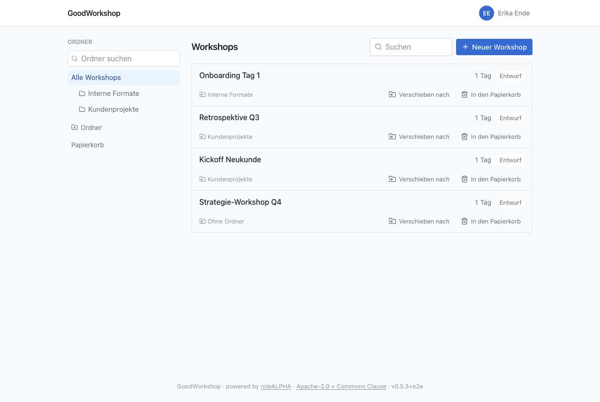

Die Bibliothek ist der Ort, an dem du nach jeder Anmeldung landest. Links stehen die Ordner,
rechts die Workshops. Beides ist freiwillig: Du kannst auch ganz ohne Ordner arbeiten.

## Was du in der Bibliothek siehst

Du siehst die Workshops, die dir gehören, die jemand mit dir geteilt hat – direkt oder über einen
Ordner – und als Admin alle Workshops des Workspaces. Die Liste ist nach der letzten Änderung
sortiert und lädt beim Scrollen weitere Einträge nach; am Ende steht dafür auch **Mehr laden**.

Jede Zeile zeigt Titel, Tags, die Zahl der Tage und den Status (zum Beispiel **Entwurf**).
Darunter stehen der Ordner – oder **Ohne Ordner** – und die Aktionen **Exportieren**,
**Verschieben nach** und **In den Papierkorb**. Auf schmalen Bildschirmen sind die Aktionen nur
Symbole. Darfst du einen Workshop nur lesen, trägt er **Nur Lesen** und bietet nur den Export an.

Ordner siehst du nur, wenn du Zugriff auf sie hast: weil du sie angelegt hast, weil sie – oder ein
Ordner darüber – mit dir geteilt sind, oder weil du Admin bist. Ist dir nur ein Unterordner
freigegeben, steht er bei dir ganz oben, und der Ordner darüber erscheint nicht – auch nicht im
Export und nicht auf der Seite **Zugriff**, wo es dann „über einen übergeordneten Ordner“ heißt.
Liegt ein Workshop, der direkt mit dir geteilt ist, in einem Ordner ohne deinen Zugriff, steht in
der Zeile **In einem Ordner, der nicht deiner ist**. In einen solchen Ordner kannst du nichts
verschieben und darin keine Ordner anlegen.

## Einen Workshop anlegen

1. Wähl links den Ordner, in dem der Workshop liegen soll, oder **Alle Workshops** für keinen.
2. Klick auf **Neuer Workshop** und gib den Titel ein. Über dem Feld steht, wo er abgelegt wird.
3. Bestätige mit **Anlegen** oder der Eingabetaste.

Der Workshop öffnet sich sofort, mit seinem ersten Tag. Er gehört dir. Umbenennen kannst du ihn später
oben auf seiner Seite: Klick neben dem Titel auf den Stift (**Workshop … umbenennen**), tipp den
neuen Namen und bestätige mit der Eingabetaste. Escape bricht ab. Das dürfen alle, die den
Workshop bearbeiten können.

## Einen Ordner anlegen

1. Klick unter dem Ordnerbaum auf **Ordner**.
2. Ist gerade ein Ordner ausgewählt, wählst du bei **Anlegen in**, ob der neue Ordner ein
   Unterordner davon wird oder auf die **Oberste Ebene** kommt.
3. Gib den Namen ein und drück die Eingabetaste.

Ordner stehen alphabetisch. Zwei Ordner mit demselben Namen im selben Ordner gibt es nicht – auch
nicht, wenn sie sich nur in Groß- und Kleinschreibung unterscheiden. Ordner mit Unterordnern
klappst du über den Pfeil vor dem Namen auf und zu. Bei vielen Ordnern hilft das Feld
**Ordner suchen**; es durchsucht auch zugeklappte Zweige.

## Workshops verschieben

Den Ordner eines Workshops ändern kannst du, wenn du ihn bearbeiten darfst.

- **Ziehen:** Fass den Knopf **Verschieben nach** in der Zeile und zieh ihn auf einen Ordner
  links. Ziehst du ihn auf **Alle Workshops**, liegt er danach in keinem Ordner mehr.
- **Auswählen:** Klick auf **Verschieben nach** und wähl den Ordner aus der Liste, oder
  **Oberste Ebene** für keinen.

Ziehen geht ab Tablet-Breite. Auf dem Handy, mit der Tastatur und mit einem Screenreader nimmst
du die Auswahlliste.

:::caution
Ein Workshop, den du in einen geteilten Ordner verschiebst, ist damit für alle geteilt, die auf
diesen Ordner Zugriff haben.
:::

## Ordner verwalten

Jeder Ordner hat rechts ein Menü (**⋮**). Darin steht für alle **Zugriff**: wer den Ordner und
alles darin sieht. Wie du einen Ordner teilst, steht unter
[Mit Personen teilen](/de/sharing/share-with-people/).

Ordner gehören dem Workspace, nicht einer Person. Darum ändern nur **Admins** an ihnen etwas:

| Aktion      | So geht's                                                                                                      |
| ----------- | -------------------------------------------------------------------------------------------------------------- |
| Umbenennen  | Menü → **Umbenennen**, neuen Namen eingeben, Eingabetaste                                                      |
| Verschieben | Den Ordner am Symbol neben dem Menü auf einen anderen ziehen, oder klicken und bei **Verschieben nach** wählen |
| Entfernen   | Menü → **Ordner entfernen — der Inhalt rückt eine Ebene hoch**, dann **Ordner entfernen** bestätigen           |

Beim Entfernen geht kein Workshop verloren: Workshops und Unterordner rücken eine Ebene nach
oben. Verloren gehen aber die Freigaben dieses Ordners. Einen Ordner in sich selbst oder in einen
seiner Unterordner zu verschieben, lehnt GoodWorkshop ab.

## Suchen

Das Feld **Suchen** über der Liste durchsucht die Titel der Workshops, und zwar innerhalb
des Ordners oder Tags, den du gerade gewählt hast. Ordner, Tag und Suchbegriff stehen in der Adresse der Seite – eine
gefilterte Bibliothek ist also ein Link, den du speichern oder weitergeben kannst.

## Weiter

- [Schlagwörter](/de/library/tags/)
- [Papierkorb](/de/library/trash/)
- [Mit Personen teilen](/de/sharing/share-with-people/)
- [Als Markdown exportieren](/de/sharing/export/)
