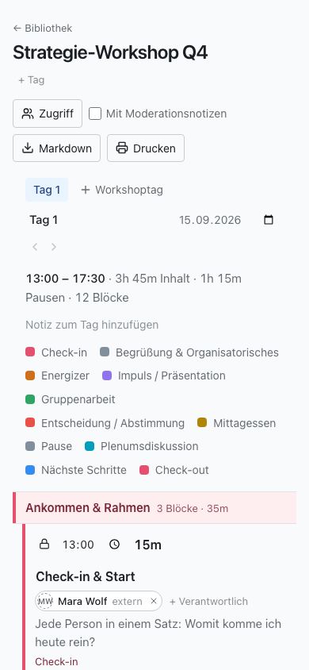

GoodWorkshop hat wenige Bildschirme: die Bibliothek, den Tageseditor und deine Einstellungen.
Diese Seite zeigt, was auf ihnen wo steht.

## Kopfzeile

Die Kopfzeile ist auf jeder Seite gleich:

- **Links** das Logo oder der Name deines Workspaces (ohne eigenes Branding: „GoodWorkshop“).
  Ein Klick darauf bringt dich in die Bibliothek.
- **Discover** – nur in der GoodWorkshop Cloud: kuratierte Workshop-Abläufe und Methoden, die du
  in deinen Workspace übernehmen kannst. Siehe [Methoden entdecken](/de/cloud/discover/).
- **Rechts** ein Kreis mit deinen Initialen und deinem Namen. Er öffnet das Profilmenü.

Unter der Kopfzeile erscheinen bei Bedarf Hinweise, etwa auf eine geplante Wartung oder – in der
Cloud – auf die verbleibenden Tage der Testphase.

## Das Profilmenü

| Eintrag                    | Was du dort findest                                                                           |
| -------------------------- | --------------------------------------------------------------------------------------------- |
| **Profil & Einstellungen** | Vor- und Nachname, Sprache, Konto löschen                                                     |
| **Sicherheit**             | Deine [Passkeys](/de/account/passkeys/)                                                       |
| **KI-Verbindung**          | Tokens und Anleitungen, um einen [KI-Assistenten zu verbinden](/de/ai/connect/)               |
| **Hilfe**                  | Diese Hilfeseiten, in einem neuen Tab                                                         |
| **Support**                | Nur in der Cloud: ein Formular, das direkt bei uns ankommt                                    |
| **Verwaltung**             | Nur für Admins: **Mitglieder**, **Branding**, **Mailversand** und in der Cloud **Abrechnung** |
| **Abmelden**               | Beendet deine Sitzung auf diesem Gerät                                                        |

## Die Bibliothek

Links steht die Spalte **Ordner**: ein Suchfeld für Ordner, **Alle Workshops**, darunter dein
Ordnerbaum, der Knopf **Ordner** zum Anlegen und der **Papierkorb**. Sobald es Tags gibt,
erscheinen sie darunter unter **Tags**.

Rechts stehen die **Workshops** mit dem Suchfeld und dem Knopf **Neuer Workshop**. Jede Zeile
zeigt Titel, Tags, die Zahl der Tage und den Status, darunter den Ordner und die Aktionen
**Exportieren**, **Verschieben nach** und **In den Papierkorb**. Mehr dazu unter
[Ordner und Workshops](/de/library/folders-and-workshops/).

## Der Tageseditor

Ein Klick auf einen Workshop öffnet seinen ersten Tag. Von oben nach unten:

1. **← Bibliothek**, der Titel des Workshops und darunter seine Tags (**+ Tag**).
2. Rechts die Ausgabe: **Zugriff**, **Mit Moderationsnotizen**, **Ganzer Workshop**,
   **Markdown** und **Drucken**.
3. Die Reiter der Tage und **Workshoptag** zum Hinzufügen. Darunter Name, Datum und Beginn des
   offenen Tags, die Pfeile zum Umsortieren und **Workshoptag löschen**.
4. Die Kopfzeile des Tags: Beginn und Ende, Inhalt, Pausen und Zahl der Blöcke, dann
   **Notiz zum Tag hinzufügen** und die Farblegende der Blocktypen.
5. Die Agenda in drei Spalten: **Zeit**, **Titel und Beschreibung** und **Zusatzinfo**.
6. Unter der Agenda **Block hinzufügen**, **Abschnitt hinzufügen** und **Breakout hinzufügen**,
   dann das **Ende** des Tags.
7. Ganz unten der Parkplatz: **Geparkt** mit den Blöcken, die nicht zur Zeit zählen.

Bearbeitet jemand anderes denselben Tag, zeigt eine Leiste über der Agenda, wer gerade da ist.
Siehe [Gemeinsam live bearbeiten](/de/agenda/live-editing/).

:::note
Wer nur lesen darf, sieht neben dem Titel **Nur Lesen** und bekommt die Agenda ohne
Bearbeitungsknöpfe.
:::

## Fußzeile

Ganz unten steht „GoodWorkshop · powered by roleALPHA“, die Lizenz und die Versionsnummer. Gib
die Versionsnummer an, wenn du ein Problem meldest – sie sagt, welchen Stand du vor dir hast.

## Auf dem Handy

GoodWorkshop ist für den Einsatz im Raum gebaut und funktioniert auf dem Handy vollständig.

- **Bibliothek:** Der Ordnerbaum ist eingeklappt. Ein Knopf über der Liste zeigt, in welchem
  Ordner du bist (oder **Alle Workshops**), und klappt den Baum auf.
- **Verschieben:** Ziehen in der Bibliothek geht erst ab Tablet-Breite. Auf dem Handy tippst du
  auf **Verschieben nach** und wählst den Ordner aus der Liste.
- **Agenda:** Jeder Block wird zu einer Karte. Die Knöpfe, die am Rechner erst beim Überfahren
  erscheinen, sind hier immer sichtbar.
- **Ziehen:** Halte den Griff eines Blocks kurz gedrückt, bevor du ziehst. Ein normales Wischen
  scrollt die Seite.
- **Schlechtes WLAN:** Bricht die Verbindung ab, sagt die Agenda das, nimmt deine Änderungen
  weiter an und überträgt sie, sobald die Verbindung wieder steht.

## Weiter

- [Den ersten Workshop planen](/de/start/quickstart/)
- [Ordner und Workshops](/de/library/folders-and-workshops/)
- [Profil und Sprache](/de/account/profile-and-language/)
