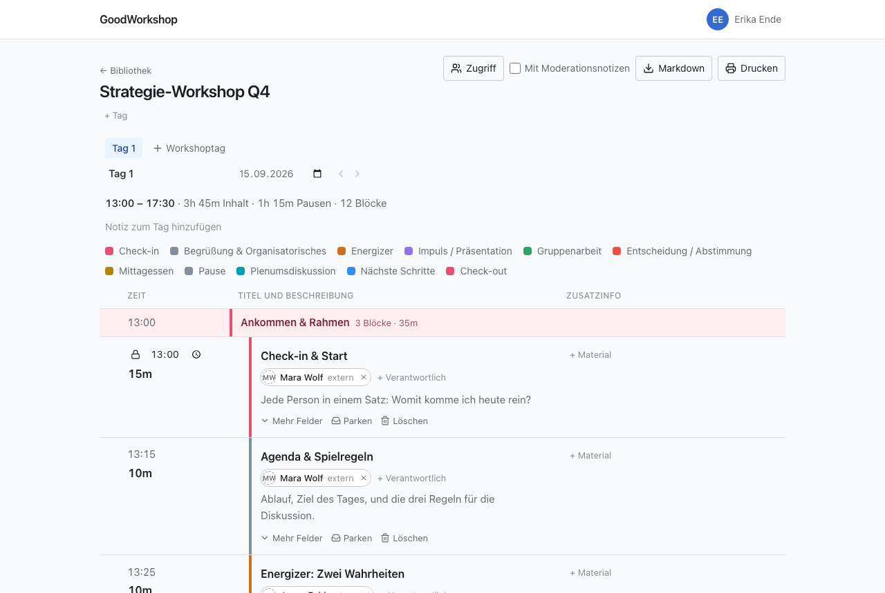

GoodWorkshop ist ein Planer für Workshop-Agenden. Du legst Blöcke mit ihrer Dauer an, und
GoodWorkshop rechnet die Uhrzeiten aus. Verschiebst du einen Block, rechnet sich der ganze Tag
neu. Was sich nicht bewegen darf – das Mittagessen um 12:30, der Termin mit der Kundin um 15:00 –
fixierst du, und alles andere ordnet sich darum herum.

## Für wen

GoodWorkshop ist für Menschen, die Workshops vorbereiten und durchführen: Moderatorinnen,
Trainer, Facilitators, interne Teams. Alles, was im Raum gebraucht wird, steht direkt in der
Zeile des Blocks: Sozialform, Material, Verantwortliche und deine Moderationsnotizen, die nur du
siehst.

## Was GoodWorkshop ausmacht

- **Die Agenda rechnet.** Startzeiten ergeben sich aus dem Beginn des Tags und den Dauern. Die
  Kopfzeile zeigt, wie viel Inhalt und wie viel Pause der Tag hat.
- **Kürzen, ohne zu verlieren.** Ein Block, der nicht mehr passt, wird geparkt statt gelöscht –
  und kann an einem anderen Tag wieder in den Ablauf.
- **Gemacht für den Raum.** Die Agenda funktioniert auf dem Handy, übersteht schlechtes WLAN und
  lässt deine Co-Moderation denselben Tag gleichzeitig bearbeiten.
- **Ohne Passwort.** Du meldest dich mit einem Passkey oder einem Link per E-Mail an.
- **Mit deiner KI.** GoodWorkshop ist selbst ein MCP-Server. Claude, ChatGPT oder ein anderer
  Assistent kann Workshops anlegen und Agenden umbauen.
- **Deine Daten bleiben deine.** Jede Agenda lässt sich jederzeit als Markdown exportieren.
- **Vier Sprachen.** Deutsch, Englisch, Französisch und Spanisch. Jede Person wählt ihre eigene;
  was du schreibst, bleibt, wie du es geschrieben hast.

## Zwei Editionen, ein Produkt

GoodWorkshop gibt es in zwei Formen. Dahinter steht derselbe Code: Planen, Teilen, Drucken,
Export und der KI-Zugang funktionieren in beiden gleich.

|                  | Community-Edition                                                      | GoodWorkshop Cloud                                                                   |
| ---------------- | ---------------------------------------------------------------------- | ------------------------------------------------------------------------------------ |
| Betrieb          | auf deinem eigenen Server, mit Docker und einer Postgres-Datenbank     | von uns, auf [goodworkshop.org](https://goodworkshop.org), in der EU                 |
| Kosten           | kostenlos, auch für kommerzielle Nutzung                               | pro aktivem Mitglied oder pro Workshop, 14 Tage kostenlos testen                     |
| Für wen          | alle, die selbst betreiben wollen                                      | nur Unternehmen                                                                      |
| Erste Anmeldung  | erste Administratorin mit dem Einrichtungsschlüssel aus dem Server-Log | Registrierung auf der Website                                                        |
| Nur in der Cloud | –                                                                      | **Discover** (kuratierte Methoden und Abläufe), **Support**-Formular, **Abrechnung** |

:::note
Die Lizenz ist Apache 2.0 mit Commons Clause: Du darfst GoodWorkshop im eigenen Haus unbegrenzt
nutzen und anpassen, aber nicht als eigenen Dienst verkaufen.
:::

Wo eine Funktion nur in der Cloud existiert, steht das auf der jeweiligen Seite ganz oben.

## Wie du weitermachst

- [Den ersten Workshop planen](/de/start/quickstart/) – in wenigen Schritten zur fertigen Agenda.
- [Wie GoodWorkshop aufgebaut ist](/de/start/how-it-works/) – Ordner, Workshops, Tage, Blöcke.
- [GoodWorkshop Cloud](/de/cloud/overview/) – wenn du nichts installieren willst.
- [Installation](/de/self-hosting/installation/) – wenn du selbst betreiben willst.
