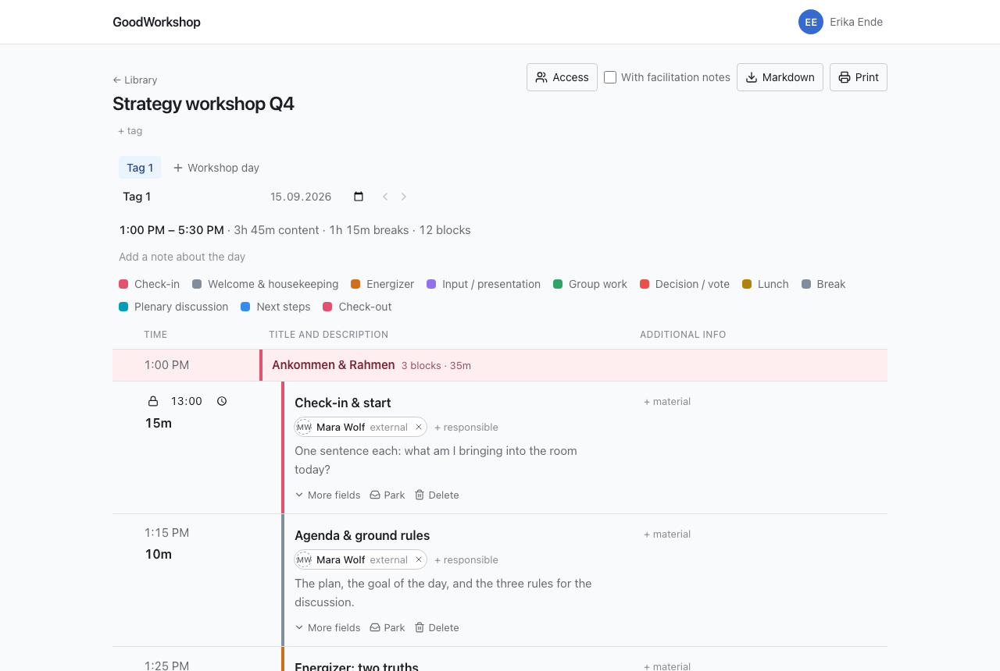

A workshop has at least one day, and each day has its own schedule. The days appear as tabs above the agenda. Clicking a tab opens that day; the link to the workshop itself always leads to the first day.

Everything on this page happens right above the agenda, with no dialog and no save button.

## Add a day

1. Click **Workshop day** to the right of the tabs.
2. The new day is added at the end, is called “Day 2”, “Day 3” and so on at first, and opens right away.

The new day takes over the **Start of the day** from the day that was last until now. So if your workshop starts at 8:30 AM, the new day starts at 8:30 AM too. The very first day of a workshop starts at 9:00 AM.

:::note[Tag or workshop day?]
Below the workshop title is **+ tag**. That is a keyword for the library and has nothing to do with the days of the schedule. That's why the buttons for days are explicitly called **Workshop day**. More under [Tags](/en/library/tags/).
:::

## Name, date and start

Below the tabs are three fields for the open day:

| Field                | What it does                                                                                                                        |
| -------------------- | ----------------------------------------------------------------------------------------------------------------------------------- |
| **Name of the day**  | The text on the tab. It is saved with Enter or when you leave the field; Escape discards the change. An empty name is not accepted. |
| **Date of the day**  | Optional. You can clear it again at any time.                                                                                       |
| **Start of the day** | The time at which the first block starts. All start times of the day depend on it.                                                  |

When you change the start, all blocks move along, except those with a fixed start time. How exactly that works together is described under [Duration and start times](/en/agenda/timing/).

:::tip
A date is worth it for guests too: an invitation to someone without an account is valid until the last day of the agenda. If the agenda has no date yet, it is valid until withdrawn. See [Share with people](/en/sharing/share-with-people/).
:::

## Reorder days

You have two ways:

- **Dragging:** Drag a tab left or right with the mouse. On a touchscreen, press and hold the tab briefly before you drag.
- **Arrows:** Next to the fields of the open day are **Move day earlier** and **Move day later**. They also work with a keyboard and a screen reader.

If the server refuses a move, the tabs jump back and a message says why.

## Note about the day

Some things don't belong to a single block but to the whole day: the room, directions, who brings the flipchart.

1. Click **Add a note about the day** below the summary.
2. Write in the **Note about the day** field.
3. It is saved as soon as you leave the field.

Anyone who may only read the day sees the note but can't change it.

## The summary

Above the schedule is a line like **1:00 PM – 5:30 PM · 3h 45m content · 1h 15m breaks · 12 blocks**. It shows the start and end of the day, how much time goes to content and how much to breaks, and how many blocks are in the schedule. Parked blocks don't count. Below it, a legend explains which color belongs to which block type, for all types that appear on that day.

## Delete a day

1. Open the day you want to delete.
2. Click **Delete workshop day**.
3. Confirm with **Delete for good**, or back out with **Cancel**.

The day's schedule is then gone, with all its blocks, sections and breakouts. You then land on the day before it, or, for the first day, on the one after it.

:::caution
This can't be undone. Only the _parked_ blocks are kept: they move to the parking area of the day before, or of the day after if you delete the first day. See [Parking area](/en/agenda/parking/).
:::

You can't delete the last remaining day; a workshop always has at least one. That's why the button only appears once there are two or more days.

## Who can do what

Members with write access to the workshop can add, name, date, reorder and delete days. Guests, even those with **Read and write**, edit a day's schedule along with you, but see neither the three fields below the tabs nor the buttons for adding, moving and deleting. So they can't change the start of a day. Anyone who may only read sees the tabs only when the workshop has more than one day.

## Related pages

- [Blocks and block types](/en/agenda/blocks/)
- [Duration and start times](/en/agenda/timing/)
- [Parking area](/en/agenda/parking/)
- [How GoodWorkshop is structured](/en/start/how-it-works/)
