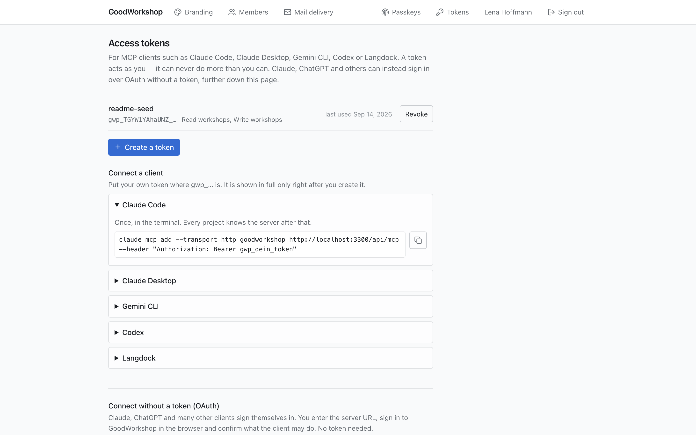

import { Tabs, TabItem } from '@astrojs/starlight/components'

There are two ways to connect an AI assistant to GoodWorkshop:

| Way                  | For whom                                                                                                                       | What you need                                                    |
| -------------------- | ------------------------------------------------------------------------------------------------------------------------------ | ---------------------------------------------------------------- |
| **OAuth** (no token) | Claude on the web, on desktop and in the app, ChatGPT, Claude Code, Gemini CLI, Mistral Le Chat, Cursor, VS Code and many more | just the server URL; you sign in in the browser and give consent |
| **Personal token**   | Clients that send a fixed header: Claude Code, Claude Desktop, Gemini CLI, Codex, Langdock                                     | a token from **AI Connection**                                   |

If your client supports OAuth, use OAuth. You'll find everything about the connection in GoodWorkshop in the profile menu at the top right under **AI Connection**.

## The server URL

```text
https://<your-installation>/api/mcp
```

In GoodWorkshop Cloud, that is:

```text
https://goodworkshop.org/api/mcp
```

On the **AI Connection** page, your installation's address is shown under **Server URL**, with a button to copy it.

## Connect with OAuth

:::caution[Sign in in the browser first]
Sign in to GoodWorkshop **first**, in the browser where the sign-in is about to open. If you only sign in along the way, you end up in the library instead of on the consent page afterwards and have to start connecting again from the client.
:::

:::note[Self-hosted on a company network?]
Claude (web, desktop, app) and ChatGPT connect from their vendors' cloud. That only works if your installation is reachable from the internet over HTTPS – see [HTTPS and reverse proxy](/en/self-hosting/tls/). Claude Code and the Gemini CLI run on your computer and also reach installations on a company network.
:::

Menu names in Claude and ChatGPT may differ slightly by language and version.

<Tabs syncKey="oauth-client">
<TabItem label="Claude">

Applies to Claude on the web, on desktop and in the app.

1. In Claude, open **Customize** → **Connectors**, click **+** and choose **Add custom connector**.
2. Give it a name, for example GoodWorkshop, and paste the server URL. Leave **Advanced settings** empty.
3. Click **Add**, then **Connect**.
4. Sign in to GoodWorkshop in the browser and click **Allow access**.

On Claude Team and Enterprise only an Owner adds the connector, under **Organization settings** → **Connectors**. Everybody else then just clicks **Connect**. The Free plan allows one custom connector.

</TabItem>
<TabItem label="ChatGPT">

1. On the web, turn on developer mode under **Settings** → **Apps** → **Advanced settings**. It is available on Plus, Pro, Business, Enterprise and Edu; in a workspace an admin may have to allow it first.
2. Under **Apps**, create a new app: name, server URL, authentication **OAuth**.
3. Save and connect.
4. Sign in to GoodWorkshop in the browser and click **Allow access**.

</TabItem>
<TabItem label="Claude Code">

Add the server in the terminal **without** a header:

```bash
claude mcp add --transport http goodworkshop https://goodworkshop.org/api/mcp
```

Then run `/mcp` in Claude Code, pick the server and choose **Authenticate**. The browser opens; sign in and click **Allow access**.

</TabItem>
<TabItem label="Gemini CLI">

Add the server in the terminal **without** a header:

```bash
gemini mcp add --transport http goodworkshop https://goodworkshop.org/api/mcp
```

The browser opens by itself on the first connection. To sign in again later, run `/mcp auth goodworkshop`.

</TabItem>
<TabItem label="Other">

Mistral Le Chat, Cursor, VS Code and others:

1. Enter the server URL.
2. Choose OAuth as authentication – clients often detect it themselves.
3. Sign in in the browser and give consent.

If a client can only send fixed headers, use a personal token (see below).

</TabItem>
</Tabs>

If you run GoodWorkshop yourself, replace `goodworkshop.org` in the commands with your own address.

### The consent page

During sign-in, GoodWorkshop shows the **Allow access?** page. It says which client is asking, for which account, and under **It will be able to:** what it may do. Over OAuth, that is:

- **Read workshops**
- **Write workshops**
- **Read block types**

Below that it says: “It acts as you … and can never do more than you can. User administration is excluded.”

You have two options: **Allow access** or **Refuse**. Deselecting individual scopes isn't possible – a client with half its rights would later fail in unexpected places.

### End OAuth access

Under **AI Connection**, the **Connected clients** section lists every client you connected over OAuth – with its scopes, since when it has been connected and when it last accessed GoodWorkshop. **Revoke access** ends the access at once: the client can no longer read or write and has to connect again. Disconnecting the connector in the client as well does no harm.

## Connect with a personal token



### Create a token

1. In the profile menu, open **AI Connection**.
2. Click **Create a token**.
3. Under **What is it for?**, enter a name, for example “Claude Desktop”.
4. Under **What may it do?**, choose the scopes (see the table below). **Read workshops** and **Read block types** are preselected – with them the assistant can read but not change anything. If it should write agendas, check **Write workshops**.
5. Click **Create a token**.

:::danger[The token is shown only once]
Under **Your new token** it appears in plain text – right afterwards never again; only a checksum is stored. Copy it now. At this moment, the instructions under **Connect a client** are already filled in with your token and your address. Whoever has the token acts as you in GoodWorkshop: treat it like a password.
:::

Later, the instructions show `gwp_…` in place of the token. Put your own token there.

### Token scopes

| Scope                 | What for                                                                               |
| --------------------- | -------------------------------------------------------------------------------------- |
| **Read workshops**    | read the library, days, bin and export; in the cloud also the method collection        |
| **Write workshops**   | create, change and delete folders, workshops, days and blocks; adopt methods           |
| **Read block types**  | read the block types and their fields – needed so the assistant fills blocks correctly |
| **Write block types** | selectable, currently not used by any tool                                             |
| **Read the tenant**   | selectable, currently not used by any tool                                             |

If a token lacks a scope, the tool tells the assistant so. Then create a new token with the right scope. User administration is deliberately not on offer.

### Set up the client

<Tabs syncKey="token-client">
<TabItem label="Claude Code">

Once, in the terminal. Every project knows the server after that.

```bash
claude mcp add --transport http goodworkshop https://goodworkshop.org/api/mcp --header "Authorization: Bearer gwp_…"
```

</TabItem>
<TabItem label="Claude Desktop">

Add this to the configuration file and restart Claude Desktop. If `"mcpServers"` is already there, only the inner part is new.

- macOS: `~/Library/Application Support/Claude/claude_desktop_config.json`
- Windows: `%APPDATA%\Claude\claude_desktop_config.json`

```json
{
  "mcpServers": {
    "goodworkshop": {
      "command": "npx",
      "args": [
        "-y",
        "mcp-remote",
        "https://goodworkshop.org/api/mcp",
        "--header",
        "Authorization:${GW_TOKEN}"
      ],
      "env": { "GW_TOKEN": "Bearer gwp_…" }
    }
  }
}
```

Copy the spelling exactly: `Authorization:${GW_TOKEN}` without a space, and the word `Bearer` in `env`. With a space, the header gets lost along the way, and every call is refused without an error message.

</TabItem>
<TabItem label="Gemini CLI">

Once, in the terminal. The entry lands in `~/.gemini/settings.json`.

```bash
gemini mcp add --transport http --header "Authorization: Bearer gwp_…" goodworkshop https://goodworkshop.org/api/mcp
```

</TabItem>
<TabItem label="Codex">

Two lines in the terminal. Codex keeps the token out of its configuration file; the entry names only the environment variable.

```bash
export GW_TOKEN=gwp_…
codex mcp add goodworkshop --url https://goodworkshop.org/api/mcp --bearer-token-env-var GW_TOKEN
```

To make it stick, the first line belongs in your shell configuration (`~/.zshrc` or `~/.bashrc`).

</TabItem>
<TabItem label="Langdock">

1. **Settings** → **Integrations** → **MCP** → **add a connection**.
2. Paste the server URL.
3. Authentication: **API Key**, header type: **Authorization: Bearer**.
4. Paste the bare token as the key – without the word “Bearer”, Langdock adds that itself.
5. **Test connection**, pick the tools, save.

</TabItem>
</Tabs>

### Revoke a token

The list on **AI Connection** shows each token with its name, scopes and when it was **last used**. **Revoke** blocks it immediately. You can only create and manage tokens for yourself; even admins don't see other people's tokens.

## See also

- [Planning with an AI assistant](/en/ai/introduction/)
- [Tool reference](/en/ai/tools/)
- [Examples](/en/ai/examples/)
- [AI connection – Troubleshooting](/en/troubleshooting/ai-connection/)
