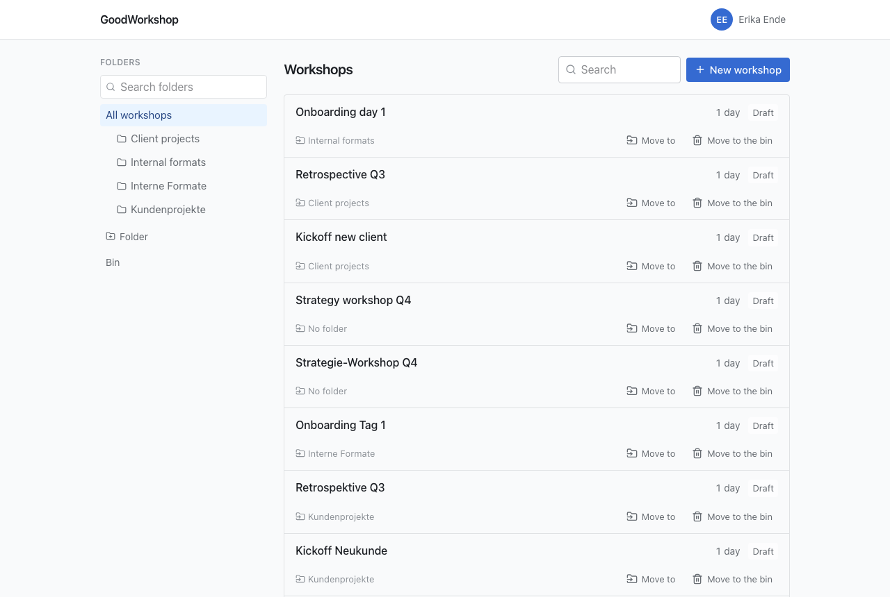

The library is where you land every time you sign in. Folders are on the left, workshops on the
right. Both are optional: you can also work entirely without folders.

## What you see in the library

You see the workshops that belong to you, the ones someone has shared with you – directly or
through a folder – and, as an admin, all workshops in the workspace. The list is sorted by the
last change and loads more entries as you scroll; there is also **Load more** at the end for
that.

Each row shows the title, tags, number of days and status (for example **Draft**). Below that
are the folder – or **No folder** – and the actions **Export**, **Move to** and
**Move to the bin**. On narrow screens the actions are icons only. If you may only read a
workshop, it shows **Read only** and offers only the export.

You only see folders you have access to: because you created them, because they – or a folder
above them – are shared with you, or because you are an admin. If only a subfolder is shared with
you, it sits at the top for you and the folder above it does not appear – not in the export
either, and not on the **Access** page, which then says "via a folder above". If a workshop shared
with you directly sits in a folder you have no access to, its row says
**In a folder that is not yours**. You cannot move anything into such a folder or create folders
in it.

## Create a workshop

1. On the left, choose the folder the workshop should go in, or **All workshops** for none.
2. Click **New workshop** and enter the title. Above the field it says where it will be filed.
3. Confirm with **Create** or the Enter key.

The workshop opens right away, with its first day. It belongs to you. You can rename it later at
the top of its page: click the pencil next to the title (**Rename workshop …**), type the new name
and press Enter. Escape cancels. Everyone who can edit the workshop may do this.

## Create a folder

1. Click **Folder** below the folder tree.
2. If a folder is currently selected, use **Create in** to choose whether the new folder becomes
   a subfolder of it or goes on the **Top level**.
3. Enter the name and press Enter.

Folders are sorted alphabetically. There can't be two folders with the same name in the same
folder – not even if they differ only in upper and lower case. You expand and collapse folders
with subfolders using the arrow in front of the name. With many folders, the **Search folders**
field helps; it also searches collapsed branches.

## Move workshops

You can change a workshop's folder if you may edit it.

- **Dragging:** Grab the **Move to** button in the row and drag it onto a folder on the left.
  If you drag it onto **All workshops**, it no longer sits in any folder afterwards.
- **Picking:** Click **Move to** and pick the folder from the list, or **Top level** for none.

Dragging works from tablet width up. On a phone, with the keyboard and with a screen reader, you
use the list.

:::caution
A workshop you move into a shared folder is thereby shared with everyone who has access to that
folder.
:::

## Manage folders

Each folder has a menu on the right (**⋮**). For everyone it contains **Access**: who sees the
folder and everything in it. How to share a folder is described under
[Share with people](/en/sharing/share-with-people/).

Folders belong to the workspace, not to a person. That's why only **admins** can change them:

| Action | How it works                                                                                            |
| ------ | ------------------------------------------------------------------------------------------------------- |
| Rename | Menu → **Rename**, enter the new name, press Enter                                                      |
| Move   | Drag the folder by the icon next to the menu onto another one, or click it and choose under **Move to** |
| Remove | Menu → **Remove the folder — its contents move up one level**, then confirm **Remove folder**           |

No workshop is lost when you remove a folder: workshops and subfolders move up one level. The
folder's sharing, however, is lost. GoodWorkshop refuses to move a folder into itself or into one
of its subfolders.

## Search

The **Search** field above the list searches workshop titles, within the folder or tag you
have currently selected. The folder, tag and search term are part of the page address – so a
filtered library is a link you can save or pass on.

## Next

- [Tags](/en/library/tags/)
- [Bin](/en/library/trash/)
- [Share with people](/en/sharing/share-with-people/)
- [Export as Markdown](/en/sharing/export/)
