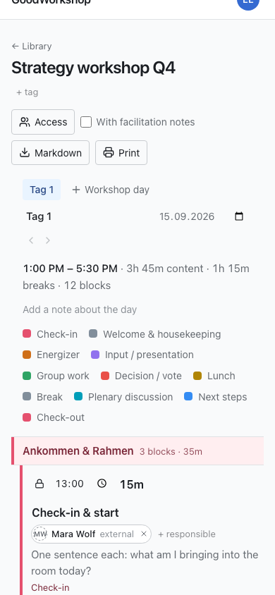

GoodWorkshop has only a few screens: the library, the day editor and your settings. This page
shows what is where on them.

## Header

The header is the same on every page:

- **Left:** your workspace's logo or name (without custom branding: “GoodWorkshop”). Clicking
  it takes you to the library.
- **Discover** – only in GoodWorkshop Cloud: curated workshop designs and methods that you can
  adopt into your workspace. See [Discover methods](/en/cloud/discover/).
- **Right:** a circle with your initials and your name. It opens the profile menu.

Below the header, notices appear when needed, for example about planned maintenance or – in the
cloud – the days left in your trial.

## The profile menu

| Entry                  | What you'll find there                                                                   |
| ---------------------- | ---------------------------------------------------------------------------------------- |
| **Profile & settings** | First and last name, language, delete account                                            |
| **Security**           | Your [passkeys](/en/account/passkeys/)                                                   |
| **AI Connection**      | Tokens and instructions for [connecting an AI assistant](/en/ai/connect/)                |
| **Help**               | These help pages, in a new tab                                                           |
| **Support**            | Cloud only: a form that reaches us directly                                              |
| **Administration**     | Admins only: **Members**, **Branding**, **Mail delivery** and, in the cloud, **Billing** |
| **Sign out**           | Ends your session on this device                                                         |

## The library

On the left is the **Folders** column: a search field for folders, **All workshops**, below it
your folder tree, the **Folder** button for creating one, and the **Bin**. As soon as there are
tags, they appear below that under **Tags**.

On the right are the **Workshops**, with the search field and the **New workshop** button. Each
row shows the title, tags, number of days and status, and below that the folder and the actions
**Export**, **Move to** and **Move to the bin**. More under
[Folders and workshops](/en/library/folders-and-workshops/).

## The day editor

Clicking a workshop opens its first day. From top to bottom:

1. **← Library**, the workshop title and below it its tags (**+ tag**).
2. On the right, the output options: **Access**, **With facilitator notes**,
   **Whole workshop**, **Markdown** and **Print**.
3. The day tabs and **Workshop day** for adding one. Below them the name, date and start of the
   open day, the arrows for reordering and **Delete workshop day**.
4. The day header: start and end, content, breaks and number of blocks, then
   **Add a note about the day** and the color legend of the block types.
5. The agenda in three columns: **Time**, **Title and description** and **Additional info**. When
   you move the mouse onto the border between two rows, a “+” appears for inserting right there.
6. Below the agenda **Add a block**, **Add section** and **Add breakout**, then the day's
   **End**.
7. At the very bottom, the parking area: **Parked**, with the blocks that don't count toward
   the time.

If someone else is editing the same day, a bar above the agenda shows who is there right now.
See [Live editing together](/en/agenda/live-editing/).

:::note
If you may only read, you'll see **Read only** next to the title and get the agenda without
editing buttons.
:::

## Footer

At the very bottom you'll find “GoodWorkshop · powered by roleALPHA”, the license and the
version number. Include the version number when you report a problem – it tells us which
release you're looking at.

## On a phone

GoodWorkshop is built for use in the room and works fully on a phone.

- **Library:** The folder tree is collapsed. A button above the list shows which folder you're
  in (or **All workshops**) and expands the tree.
- **Moving:** Dragging in the library only works from tablet width up. On a phone, tap
  **Move to** and pick the folder from the list.
- **Agenda:** Every block becomes a card. The buttons that only appear on hover on a computer
  are always visible here.
- **Dragging:** Press and hold a block's handle briefly before you drag. A normal swipe scrolls
  the page.
- **Bad Wi-Fi:** If the connection drops, the agenda tells you, keeps accepting your changes and
  sends them as soon as the connection is back.

## Next

- [Plan your first workshop](/en/start/quickstart/)
- [Folders and workshops](/en/library/folders-and-workshops/)
- [Profile and language](/en/account/profile-and-language/)
