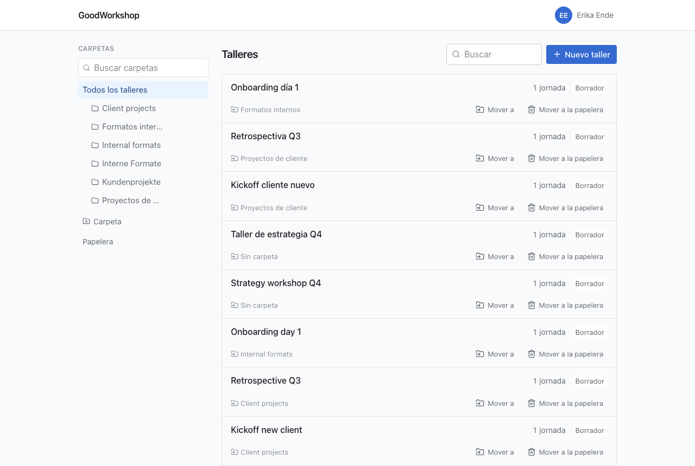
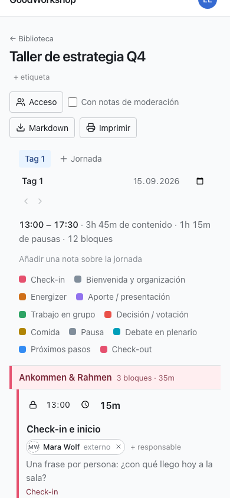

GoodWorkshop tiene pocas pantallas: la biblioteca, el editor de jornadas y tus ajustes. Esta
página muestra qué hay en cada una y dónde.

## Cabecera

La cabecera es igual en todas las páginas:

- **A la izquierda**, el logotipo o el nombre de tu espacio de trabajo (sin identidad visual
  propia: «GoodWorkshop»). Un clic te lleva a la biblioteca.
- **Discover**: solo en GoodWorkshop Cloud; agendas de talleres y métodos seleccionados que
  puedes incorporar a tu espacio de trabajo. Consulta [Descubrir métodos](/es/cloud/discover/).
- **A la derecha**, un círculo con tus iniciales y tu nombre. Abre el menú de perfil.

Debajo de la cabecera aparecen avisos cuando hace falta, por ejemplo sobre un mantenimiento
previsto o, en la nube, sobre los días que quedan del periodo de prueba.

## El menú de perfil

| Entrada              | Qué encuentras ahí                                                                                                |
| -------------------- | ----------------------------------------------------------------------------------------------------------------- |
| **Perfil y ajustes** | Nombre y apellidos, idioma, eliminar la cuenta                                                                    |
| **Seguridad**        | Tus [passkeys](/es/account/passkeys/)                                                                             |
| **Conexión IA**      | Tokens e instrucciones para [conectar un asistente de IA](/es/ai/connect/)                                        |
| **Ayuda**            | Estas páginas de ayuda, en una pestaña nueva                                                                      |
| **Soporte**          | Solo en la nube: un formulario que nos llega directamente                                                         |
| **Administración**   | Solo para administradores: **Miembros**, **Identidad visual**, **Envío de correo** y, en la nube, **Facturación** |
| **Cerrar sesión**    | Termina tu sesión en este dispositivo                                                                             |

## La biblioteca

A la izquierda está la columna **Carpetas**: un campo de búsqueda de carpetas, **Todos los
talleres**, debajo tu árbol de carpetas, el botón **Carpeta** para crear una y la **Papelera**. En
cuanto hay etiquetas, aparecen debajo, en **Etiquetas**.

A la derecha están los **Talleres**, con el campo de búsqueda y el botón **Nuevo taller**. Cada
fila muestra el título, las etiquetas, el número de jornadas y el estado, y debajo la carpeta y
las acciones **Exportar**, **Mover a** y **Mover a la papelera**. Más en
[Carpetas y talleres](/es/library/folders-and-workshops/).

## El editor de jornadas

Un clic en un taller abre su primera jornada. De arriba abajo:

1. **← Biblioteca**, el título del taller y debajo sus etiquetas (**+ etiqueta**).
2. A la derecha, la salida: **Acceso**, **Con notas de facilitación**, **Todo el taller**,
   **Markdown** e **Imprimir**.
3. Las pestañas de las jornadas y **Jornada** para añadir una. Debajo, el nombre, la fecha y el
   comienzo de la jornada abierta, las flechas para reordenar y **Eliminar jornada del taller**.
4. La cabecera de la jornada: comienzo y fin, contenido, pausas y número de bloques; después
   **Añadir una nota sobre la jornada** y la leyenda de colores de los tipos de bloque.
5. La agenda en tres columnas: **Hora**, **Título y descripción** e **Información adicional**.
   Si pasas el ratón por el borde entre dos filas, aparece un «+» para insertar justo ahí.
6. Debajo de la agenda, **Añadir un bloque**, **Añadir sección** y **Añadir breakout**; después
   el **Fin** de la jornada.
7. Abajo del todo, los apartados: **Apartados**, con los bloques que no cuentan para el tiempo.

Si otra persona edita la misma jornada, una barra encima de la agenda muestra quién está ahí en
ese momento. Consulta [Editar juntos en directo](/es/agenda/live-editing/).

:::note
Quien solo puede leer ve **Solo lectura** junto al título y recibe la agenda sin botones de
edición.
:::

## Pie de página

Abajo del todo aparecen «GoodWorkshop · powered by roleALPHA», la licencia y el número de versión.
Indica el número de versión cuando informes de un problema: dice qué versión tienes delante.

## En el móvil

GoodWorkshop está hecho para usarse en la sala y funciona por completo en el móvil.

- **Biblioteca:** el árbol de carpetas está plegado. Un botón encima de la lista muestra en qué
  carpeta estás (o **Todos los talleres**) y despliega el árbol.
- **Mover:** arrastrar en la biblioteca solo funciona a partir del ancho de una tableta. En el
  móvil tocas **Mover a** y eliges la carpeta en la lista.
- **Agenda:** cada bloque se convierte en una tarjeta. Los botones que en el ordenador solo
  aparecen al pasar el ratón por encima están aquí siempre visibles.
- **Arrastrar:** mantén pulsada el asa de un bloque un momento antes de arrastrar. Un
  deslizamiento normal desplaza la página.
- **Wifi malo:** si se corta la conexión, la agenda lo indica, sigue aceptando tus cambios y los
  envía en cuanto la conexión vuelve.

## Siguiente

- [Planificar el primer taller](/es/start/quickstart/)
- [Carpetas y talleres](/es/library/folders-and-workshops/)
- [Perfil e idioma](/es/account/profile-and-language/)
