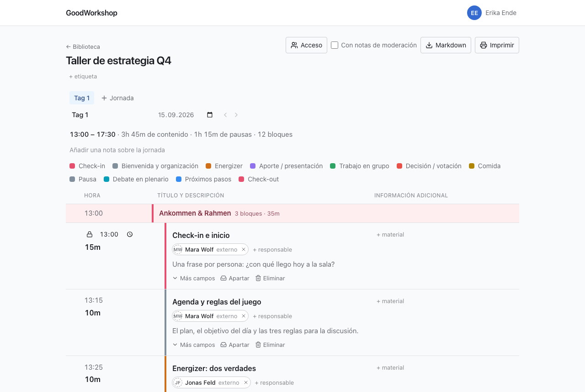

GoodWorkshop es un planificador de agendas de talleres. Creas bloques con su duración y
GoodWorkshop calcula las horas. Si mueves un bloque, toda la jornada se recalcula. Lo que no puede
moverse (la comida a las 12:30, la cita con la clienta a las 15:00) lo fijas, y todo lo demás se
ordena a su alrededor.

## Para quién

GoodWorkshop es para quienes preparan y dirigen talleres: facilitadoras, formadores, facilitators,
equipos internos. Todo lo que se necesita en la sala está directamente en la fila del bloque:
formato, material, responsables y tus notas de facilitación, que solo ves tú.

## Qué distingue a GoodWorkshop

- **La agenda calcula.** Las horas de inicio salen del comienzo de la jornada y de las
  duraciones. La cabecera muestra cuánto contenido y cuántas pausas tiene la jornada.
- **Recortar sin perder.** Un bloque que ya no cabe se aparta en lugar de eliminarse, y puede
  volver al desarrollo en otra jornada.
- **Hecho para la sala.** La agenda funciona en el móvil, aguanta un wifi malo y deja que tu
  co-facilitación edite la misma jornada a la vez.
- **Sin contraseña.** Inicias sesión con un passkey o con un enlace por correo electrónico.
- **Con tu IA.** GoodWorkshop es en sí mismo un servidor MCP. Claude, ChatGPT u otro asistente
  puede crear talleres y reorganizar agendas.
- **Tus datos siguen siendo tuyos.** Cualquier agenda se puede exportar como Markdown en todo
  momento.
- **Cuatro idiomas.** Alemán, inglés, francés y español. Cada persona elige el suyo; lo que
  escribes se queda tal como lo escribiste.

## Dos ediciones, un producto

GoodWorkshop existe en dos formas. Detrás está el mismo código: planificar, compartir, imprimir,
exportar y el acceso para la IA funcionan igual en ambas.

|                 | Edición Community                                                               | GoodWorkshop Cloud                                                                         |
| --------------- | ------------------------------------------------------------------------------- | ------------------------------------------------------------------------------------------ |
| Funcionamiento  | en tu propio servidor, con Docker y una base de datos Postgres                  | lo gestionamos nosotros, en [goodworkshop.org](https://goodworkshop.org), en la UE         |
| Coste           | gratis, también para uso comercial                                              | por miembro activo o por taller, 14 días de prueba gratis                                  |
| Para quién      | para quien quiera alojarlo por su cuenta                                        | solo empresas                                                                              |
| Primer inicio   | la primera administradora con la clave de instalación del registro del servidor | registro en el sitio web                                                                   |
| Solo en la nube | –                                                                               | **Discover** (métodos y agendas seleccionados), formulario de **Soporte**, **Facturación** |

:::note
La licencia es Apache 2.0 con Commons Clause: puedes usar y adaptar GoodWorkshop en tu
organización sin límites, pero no venderlo como servicio propio.
:::

Cuando una función solo existe en la nube, lo indica la página correspondiente arriba del todo.

## Cómo seguir

- [Planificar el primer taller](/es/start/quickstart/): en pocos pasos hasta la agenda terminada.
- [Cómo está organizado GoodWorkshop](/es/start/how-it-works/): carpetas, talleres, jornadas, bloques.
- [GoodWorkshop Cloud](/es/cloud/overview/): si no quieres instalar nada.
- [Instalación](/es/self-hosting/installation/): si quieres alojarlo por tu cuenta.
