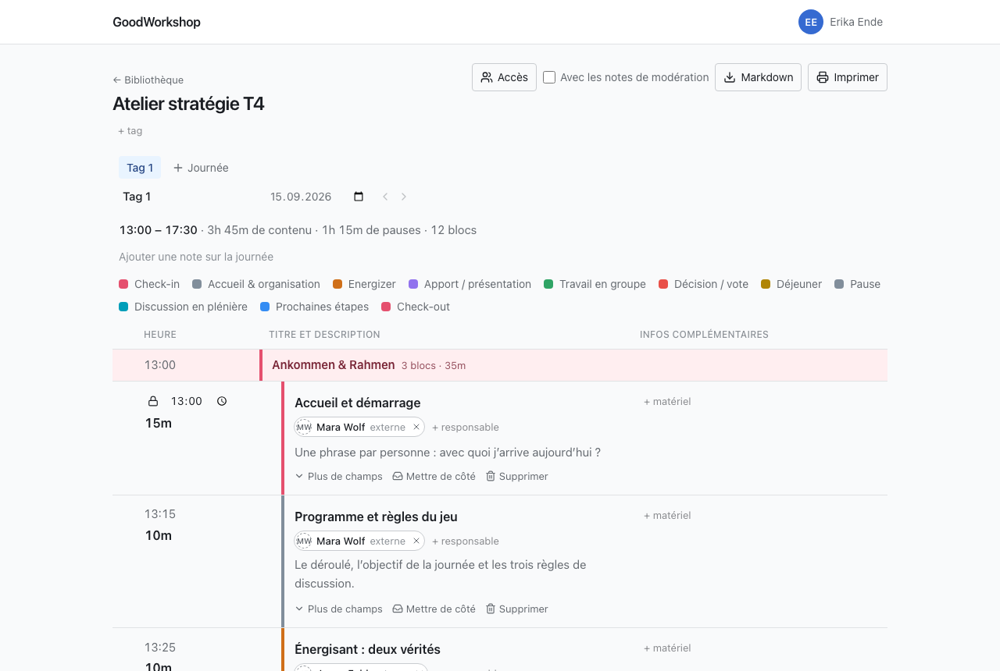

Un atelier compte au moins une journée, et chaque journée a son propre déroulé. Les journées apparaissent sous forme d'onglets au-dessus de l'agenda. Un clic sur un onglet ouvre cette journée ; le lien vers l'atelier lui-même mène toujours à la première journée.

Tout ce qui est décrit sur cette page se fait directement au-dessus de l'agenda, sans boîte de dialogue ni bouton d'enregistrement.

## Ajouter une journée

1. Clique sur **Journée**, à droite des onglets.
2. La nouvelle journée s'ajoute à la fin, s'appelle d'abord « Journée 2 », « Journée 3 » et ainsi de suite, et s'ouvre aussitôt.

La nouvelle journée reprend le **Début de la journée** de la dernière journée existante. Si ton atelier commence à 08:30, la nouvelle journée commence donc aussi à 08:30. La toute première journée d'un atelier commence à 09:00.

:::note[« Tag » ou « Journée » ?]
Sous le titre de l'atelier se trouve **+ tag**. C'est une étiquette pour la bibliothèque, qui n'a rien à voir avec les journées du déroulé. C'est pourquoi les boutons des journées s'appellent explicitement **Journée**. Pour en savoir plus, voir [Tags](/fr/library/tags/).
:::

## Nom, date et début

Sous les onglets se trouvent trois champs pour la journée ouverte :

| Champ                   | Ce qu'il fait                                                                                                                                          |
| ----------------------- | ------------------------------------------------------------------------------------------------------------------------------------------------------ |
| **Nom de la journée**   | Le texte de l'onglet. Il est enregistré avec Entrée ou quand tu quittes le champ ; Échap annule la modification. Un nom vide n'est pas pris en compte. |
| **Date de la journée**  | Facultative. Tu peux la vider à tout moment.                                                                                                           |
| **Début de la journée** | L'heure à laquelle commence le premier bloc. Toutes les heures de début de la journée en dépendent.                                                    |

Si tu modifies le début, tous les blocs suivent, sauf ceux dont l'heure de début est fixée. Le détail de ce fonctionnement se trouve dans [Durée et heures de début](/fr/agenda/timing/).

:::tip
La date est utile aussi pour les invités : une invitation envoyée à quelqu'un sans compte est valable jusqu'à la dernière journée de l'agenda. Si l'agenda n'a pas encore de date, elle reste valable jusqu'à sa révocation. Voir [Partager avec des personnes](/fr/sharing/share-with-people/).
:::

## Réordonner les journées

Tu as deux possibilités :

- **Glisser :** fais glisser un onglet avec la souris vers la gauche ou la droite. Sur un écran tactile, maintiens l'onglet appuyé un instant avant de le faire glisser.
- **Flèches :** à côté des champs de la journée ouverte se trouvent **Avancer la journée** et **Reculer la journée**. Elles fonctionnent aussi au clavier et avec un lecteur d'écran.

Si le serveur refuse un déplacement, les onglets reviennent à leur place et un message en indique la raison.

## Note sur la journée

Certaines choses n'appartiennent à aucun bloc en particulier, mais à toute la journée : la salle, l'accès, qui apporte le paperboard.

1. Sous le résumé, clique sur **Ajouter une note sur la journée**.
2. Écris dans le champ **Note sur la journée**.
3. L'enregistrement se fait dès que tu quittes le champ.

Qui peut seulement lire la journée voit la note, mais ne peut pas la modifier.

## Le résumé

Au-dessus du déroulé figure une ligne comme **13:00 – 17:30 · 3h 45m de contenu · 1h 15m de pauses · 12 blocs**. Elle indique le début et la fin de la journée, le temps consacré au contenu et aux pauses, et le nombre de blocs du déroulé. Les blocs mis de côté ne sont pas comptés. En dessous, une légende indique quelle couleur correspond à quel type de bloc, pour tous les types présents ce jour-là.

## Supprimer une journée

1. Ouvre la journée que tu veux supprimer.
2. Clique sur **Supprimer la journée d'atelier**.
3. Confirme avec **Supprimer définitivement** ou abandonne avec **Annuler**.

Le déroulé de la journée disparaît alors, avec tous ses blocs, sections et breakouts. Tu arrives ensuite sur la journée précédente, ou sur la suivante si c'était la première.

:::caution
C'est irréversible. Seuls les blocs _mis de côté_ sont conservés : ils passent dans la zone « De côté » de la journée précédente, ou de la suivante si tu supprimes la première journée. Voir [Blocs mis de côté](/fr/agenda/parking/).
:::

Tu ne peux pas supprimer la dernière journée restante ; un atelier en a toujours au moins une. Le bouton n'apparaît donc qu'à partir de deux journées.

## Qui peut faire quoi

Les membres disposant du droit d'écriture sur l'atelier peuvent créer, nommer, dater, réordonner et supprimer des journées. Les invités, même avec **Lecture et écriture**, modifient le déroulé d'une journée, mais ne voient ni les trois champs sous les onglets ni les boutons pour créer, déplacer et supprimer. Ils ne peuvent donc pas modifier le début d'une journée. Qui peut seulement lire ne voit les onglets que si l'atelier compte plus d'une journée.

## Pages associées

- [Blocs et types de blocs](/fr/agenda/blocks/)
- [Durée et heures de début](/fr/agenda/timing/)
- [Blocs mis de côté](/fr/agenda/parking/)
- [Comment GoodWorkshop est organisé](/fr/start/how-it-works/)
