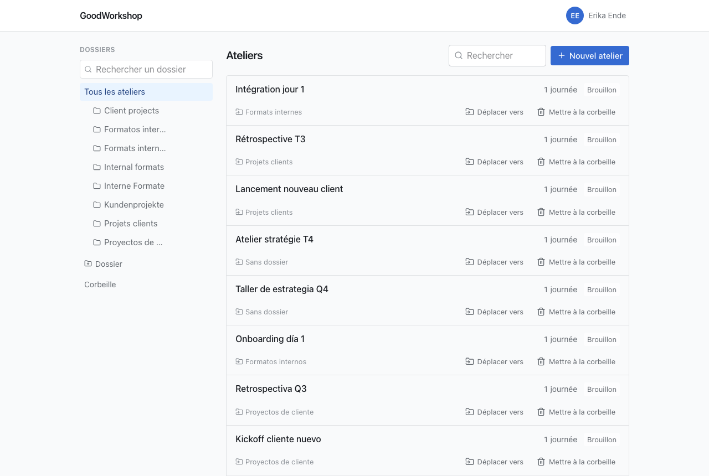

La bibliothèque est l'endroit où tu arrives après chaque connexion. À gauche les dossiers, à droite
les ateliers. Les deux sont facultatifs : tu peux aussi travailler sans aucun dossier.

## Ce que tu vois dans la bibliothèque

Tu vois les ateliers qui t'appartiennent, ceux que quelqu'un a partagés avec toi – directement ou
via un dossier – et, si tu es admin, tous les ateliers de l'espace de travail. La liste est triée
par dernière modification et charge d'autres entrées au défilement ; en bas, il y a aussi
**Charger plus** pour cela.

Chaque ligne affiche le titre, les tags, le nombre de journées et le statut (par exemple
**Brouillon**). En dessous figurent le dossier – ou **Sans dossier** – et les actions **Exporter**,
**Déplacer vers** et **Mettre à la corbeille**. Sur les écrans étroits, les actions ne sont que des
icônes. Si tu n'as que le droit de lecture sur un atelier, il porte la mention **Lecture seule** et
ne propose que l'export.

## Créer un atelier

1. Choisis à gauche le dossier dans lequel l'atelier doit se trouver, ou **Tous les ateliers**
   pour aucun.
2. Clique sur **Nouvel atelier** et saisis le titre. Au-dessus du champ, il est indiqué où il sera
   rangé.
3. Valide avec **Créer** ou la touche Entrée.

L'atelier s'ouvre aussitôt, avec sa première journée. Il t'appartient. Le titre d'un atelier se
définit ici ; dans l'application elle-même, il ne peut plus être renommé ensuite, mais c'est
possible via l'[assistant IA](/fr/ai/tools/).

## Créer un dossier

1. Clique sous l'arborescence des dossiers sur **Dossier**.
2. Si un dossier est sélectionné, choisis dans **Créer dans** si le nouveau dossier devient un
   sous-dossier de celui-ci ou s'il va au **Niveau supérieur**.
3. Saisis le nom et appuie sur Entrée.

Les dossiers sont classés par ordre alphabétique. Deux dossiers portant le même nom dans le même
dossier, ce n'est pas possible – même s'ils ne diffèrent que par les majuscules et minuscules. Tu
déplies et replies les dossiers qui contiennent des sous-dossiers avec la flèche devant leur nom.
Quand il y a beaucoup de dossiers, le champ **Rechercher un dossier** aide ; il cherche aussi dans
les branches repliées.

## Déplacer des ateliers

Tu peux changer le dossier d'un atelier si tu as le droit de le modifier.

- **Glisser :** saisis le bouton **Déplacer vers** de la ligne et fais-le glisser sur un dossier à
  gauche. Si tu le déposes sur **Tous les ateliers**, il ne se trouve plus dans aucun dossier.
- **Choisir :** clique sur **Déplacer vers** et choisis le dossier dans la liste, ou
  **Niveau supérieur** pour aucun.

Le glisser-déposer fonctionne à partir d'une largeur de tablette. Sur le téléphone, au clavier et
avec un lecteur d'écran, utilise la liste de choix.

:::caution
Un atelier que tu déplaces dans un dossier partagé est de ce fait partagé avec toutes les personnes
qui ont accès à ce dossier.
:::

## Gérer les dossiers

Chaque dossier a un menu à droite (**⋮**). Tout le monde y trouve **Accès** : qui voit le dossier
et tout ce qu'il contient. Comment partager un dossier est expliqué dans
[Partager avec des personnes](/fr/sharing/share-with-people/).

Les dossiers appartiennent à l'espace de travail, pas à une personne. C'est pourquoi seuls les
**Admins** peuvent les modifier :

| Action    | Comment faire                                                                                                          |
| --------- | ---------------------------------------------------------------------------------------------------------------------- |
| Renommer  | Menu → **Renommer**, saisir le nouveau nom, touche Entrée                                                              |
| Déplacer  | Faire glisser le dossier par l'icône à côté du menu sur un autre dossier, ou cliquer et choisir dans **Déplacer vers** |
| Supprimer | Menu → **Supprimer le dossier — son contenu remonte d'un niveau**, puis confirmer avec **Supprimer le dossier**        |

La suppression ne fait perdre aucun atelier : les ateliers et les sous-dossiers remontent d'un
niveau. En revanche, les partages de ce dossier sont perdus. GoodWorkshop refuse de déplacer un
dossier dans lui-même ou dans l'un de ses sous-dossiers.

## Rechercher

Le champ **Rechercher** au-dessus de la liste cherche dans les titres des ateliers, à l'intérieur du
dossier ou du tag que tu as sélectionné. Le dossier, le tag et le terme recherché figurent dans
l'adresse de la page – une bibliothèque filtrée est donc un lien que tu peux enregistrer ou
transmettre.

## Pour continuer

- [Mots-clés](/fr/library/tags/)
- [Corbeille](/fr/library/trash/)
- [Partager avec des personnes](/fr/sharing/share-with-people/)
- [Exporter en Markdown](/fr/sharing/export/)
