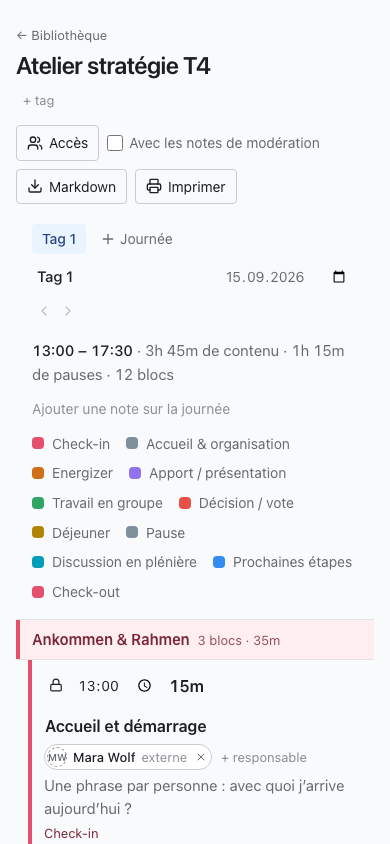

GoodWorkshop compte peu d'écrans : la bibliothèque, l'éditeur de journée et tes réglages. Cette
page montre ce qui s'y trouve et où.

## En-tête

L'en-tête est le même sur chaque page :

- **À gauche**, le logo ou le nom de ton espace de travail (sans identité visuelle propre :
  « GoodWorkshop »). Un clic dessus te ramène à la bibliothèque.
- **Discover** – uniquement dans GoodWorkshop Cloud : des déroulés d'atelier et des méthodes
  sélectionnés, que tu peux reprendre dans ton espace de travail. Voir
  [Découvrir des méthodes](/fr/cloud/discover/).
- **À droite**, un cercle avec tes initiales et ton nom. Il ouvre le menu du profil.

Sous l'en-tête apparaissent au besoin des avis, par exemple sur une maintenance prévue ou – dans
Cloud – sur les jours restants de la période d'essai.

## Le menu du profil

| Entrée                 | Ce que tu y trouves                                                                                                  |
| ---------------------- | -------------------------------------------------------------------------------------------------------------------- |
| **Profil et réglages** | Prénom et nom, langue, suppression du compte                                                                         |
| **Sécurité**           | Tes [passkeys](/fr/account/passkeys/)                                                                                |
| **Connexion IA**       | Jetons et guides pour [connecter un assistant IA](/fr/ai/connect/)                                                   |
| **Aide**               | Ces pages d'aide, dans un nouvel onglet                                                                              |
| **Support**            | Uniquement dans Cloud : un formulaire qui nous parvient directement                                                  |
| **Administration**     | Uniquement pour les admins : **Membres**, **Identité visuelle**, **Envoi d'e-mails** et, dans Cloud, **Facturation** |
| **Se déconnecter**     | Termine ta session sur cet appareil                                                                                  |

## La bibliothèque

À gauche se trouve la colonne **Dossiers** : un champ de recherche pour les dossiers, **Tous les
ateliers**, en dessous ton arborescence de dossiers, le bouton **Dossier** pour en créer un et la
**Corbeille**. Dès qu'il existe des tags, ils apparaissent en dessous, sous **Tags**.

À droite se trouvent les **Ateliers**, avec le champ de recherche et le bouton **Nouvel atelier**.
Chaque ligne affiche le titre, les tags, le nombre de journées et le statut, et en dessous le
dossier et les actions **Exporter**, **Déplacer vers** et **Mettre à la corbeille**. Pour en savoir
plus : [Dossiers et ateliers](/fr/library/folders-and-workshops/).

## L'éditeur de journée

Un clic sur un atelier ouvre sa première journée. De haut en bas :

1. **← Bibliothèque**, le titre de l'atelier et, en dessous, ses tags (**+ tag**).
2. À droite, les sorties : **Accès**, **Avec les notes de modération**, **Tout l'atelier**,
   **Markdown** et **Imprimer**.
3. Les onglets des journées et **Journée** pour en ajouter une. En dessous, le nom, la date et le
   début de la journée ouverte, les flèches pour réordonner et **Supprimer la journée d'atelier**.
4. L'en-tête de la journée : début et fin, contenu, pauses et nombre de blocs, puis
   **Ajouter une note sur la journée** et la légende des couleurs des types de blocs.
5. L'agenda en trois colonnes : **Heure**, **Titre et description** et **Infos complémentaires**.
6. Sous l'agenda, **Ajouter un bloc**, **Ajouter une section** et **Ajouter un breakout**, puis la
   **Fin** de la journée.
7. Tout en bas, les blocs mis de côté : **De côté**, avec les blocs qui ne comptent pas dans le
   temps.

Si quelqu'un d'autre modifie la même journée, une barre au-dessus de l'agenda montre qui est là en
ce moment. Voir [Modifier ensemble en direct](/fr/agenda/live-editing/).

:::note
Qui n'a que le droit de lecture voit **Lecture seule** à côté du titre et reçoit l'agenda sans
boutons de modification.
:::

## Pied de page

Tout en bas figurent « GoodWorkshop · powered by roleALPHA », la licence et le numéro de version.
Indique le numéro de version quand tu signales un problème – il dit quelle version tu as devant
toi.

## Sur le téléphone

GoodWorkshop est conçu pour être utilisé dans la salle et fonctionne entièrement sur le téléphone.

- **Bibliothèque :** l'arborescence des dossiers est repliée. Un bouton au-dessus de la liste
  indique dans quel dossier tu te trouves (ou **Tous les ateliers**) et déplie l'arborescence.
- **Déplacer :** le glisser-déposer dans la bibliothèque ne fonctionne qu'à partir d'une largeur
  de tablette. Sur le téléphone, touche **Déplacer vers** et choisis le dossier dans la liste.
- **Agenda :** chaque bloc devient une carte. Les boutons qui, sur ordinateur, n'apparaissent
  qu'au survol sont ici toujours visibles.
- **Glisser :** maintiens la poignée d'un bloc appuyée un instant avant de glisser. Un simple
  balayage fait défiler la page.
- **Mauvais Wi-Fi :** si la connexion est coupée, l'agenda le signale, continue d'accepter tes
  modifications et les transmet dès que la connexion est rétablie.

## Pour continuer

- [Planifier ton premier atelier](/fr/start/quickstart/)
- [Dossiers et ateliers](/fr/library/folders-and-workshops/)
- [Profil et langue](/fr/account/profile-and-language/)
